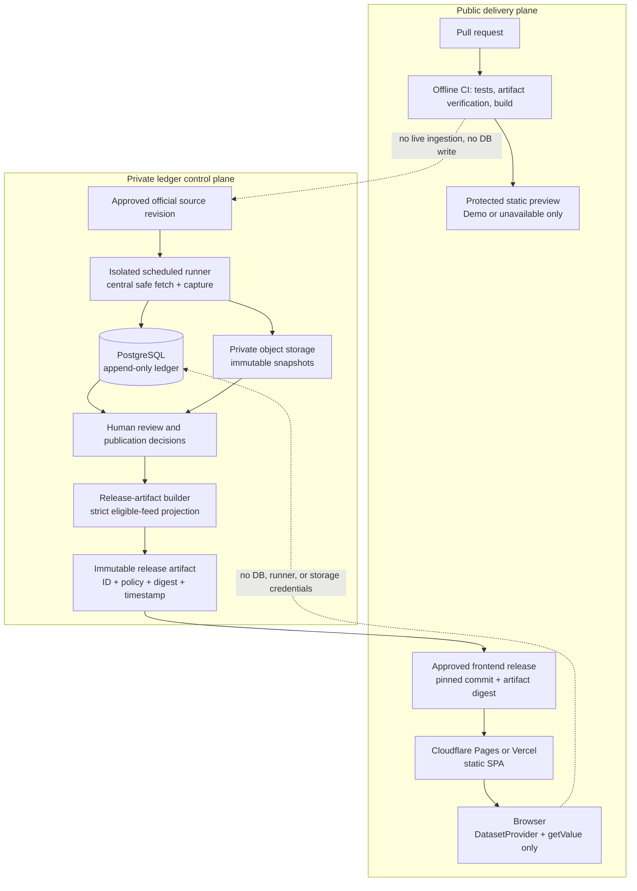
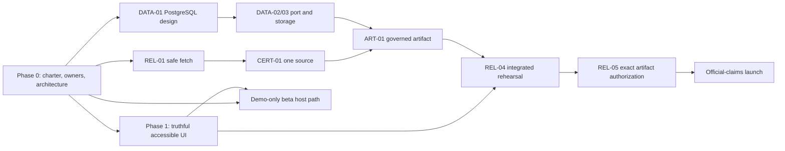

# Production launch architecture and release plan

**Status:** active implementation plan. The original planning synthesis did not
provision cloud infrastructure, ingest a live source, migrate a durable
database, deploy, or activate Official mode. The authority-free local tranche
recorded below is implementation evidence, not release authorization.

**Date:** 2026-07-14

**Extends:** [Official-mode remediation implementation plan](2026-07-13-official-mode-remediation-implementation-plan.md). This plan is a forward-looking status addendum and must not rewrite that plan's historical receipts.

## Executive decision

The product is **not ready for an Official-claims production launch**. The current containment posture is intentional and correct: Official publication is disabled, no source is certified for publication, the frontend accepts only the unavailable-artifact sentinel, and the ledger is still a local SQLite/filesystem implementation. The remaining work is not a hosting switch; it is a governed data-product and release-control buildout.

There are two valid launch tracks:

| Track | What may be launched | What it must not imply | Minimum gate |
| --- | --- | --- | --- |
| **Demo-only public beta** | The existing synthetic-data SPA, accurately labelled Demo/synthetic with Official unavailable. | That any visible score is official, source-backed, current, or independently verified. | Public-static security/quality gate plus accurate copy and operational ownership. |
| **Official-claims production launch** | A static frontend rendering one explicitly approved, immutable Official release artifact. | That the browser queried mutable ledger claims, that every claim has a stronger guarantee than its evidence supports, or that candidate/legacy data is published. | Every phase and go/no-go gate in this plan. |

The recommended initial production shape for the Official track is **a static Vite site on Cloudflare Pages, with the approved artifact packaged and digest-pinned with the frontend release**. Vercel is an equally viable static-hosting alternative when it better matches the team's existing operational ownership. The public host is deliberately separate from private ledger operations. A Cloudflare Worker or other public data API is **not** in launch scope: add one only after a concrete use case, threat model, cache/withdrawal design, and release-control review show that serving exact approved immutable bytes cannot remain a static deployment.

The recommended private data plane is a managed PostgreSQL candidate such as Supabase, a provider-neutral object store for immutable snapshots and release artifacts, and an isolated scheduled runner. These are provisional architecture choices, not authorization to create an account, spend money, migrate data, or deploy infrastructure. Provider, region, pricing, retention, and backup capabilities must be confirmed and approved by the accountable owner before implementation.

## Planning boundary and non-goals

This plan preserves the repository's existing containment rules.

- The ledger continues to record source-backed claims; it never runs benchmarks or recalculates official scores.
- Raw source values, immutable snapshots, append-only claims, review decisions, and publication decisions remain the system of record.
- Candidate projections (LDR-08), legacy inventory reports (LDR-09), test fixtures, samples, ignored exports, and any fallback/mock artifact remain non-public and must never become frontend inputs.
- The browser receives no database credential, service-role key, snapshot store credential, ingestion control, or direct claim-query capability.
- CI does not perform live source ingestion, benchmark execution, public export, or mutable database writes.
- There is no ledger web UI in this scope, no destructive migration/recovery path, and no paid-cloud action in this planning work.
- The public frontend keeps `getValue(modelId, benchmarkId)` as its sole score accessor and retains the immutable `DatasetProvider` boundary.

### Local implementation addendum (2026-07-14)

The following authority-free work was completed locally after this plan was
approved for implementation. It did not create a provider account, spend money,
make a live source request, write a claim/snapshot/run, migrate a user database,
package a public artifact, or enable Official mode:

- UI-05/06/09: coverage-aware presentation ranks and category leaders, explicit
  no-data/unknown metadata and radar behavior, and an accessible root error
  boundary that refuses a hidden Demo fallback.
- REL-01 foundation: adapters no longer own HTTP clients; a central,
  source-revision-bound safe fetch plan rejects unsafe DNS, redirect, byte, and
  MIME cases. Its default transport fails closed pending an approved private
  runner that can prove peer/egress controls.
- REL-02/03/DATA-01 design: verification actions are SHA-pinned with minimal
  permissions and reviewed Python constraints; the PR process and runbooks
  describe containment; ADR-007 records the PostgreSQL/object-store port proof
  requirements.

The remaining P0 decisions still block live transport, source certification,
provider work, browser/assistive-technology launch evidence, release artifact
building, and any public deployment. See the implementation ledger beside this
plan for exact test receipts and unresolved blockers.

### Recorded product direction (2026-07-15)

The user selected the **Official-claims production** track and **Cloudflare
Pages** for the static public frontend. This narrows the architecture decision;
it does not authorize a Cloudflare account, DNS, a Worker/public API, a deploy,
source capture, or Official-mode activation. P0-01 and P0-02 remain partially
open until accountable product/release and host operators are named and the
remaining Phase 0 decisions are recorded in the launch charter.

The user also requested recovery that loses no more than one scheduled
source-capture cycle and broad access across browsers and assistive technology.
The launch charter now records a proposed, testable operating target and
support matrix; neither is a provider capability claim or release approval.
The first-source decision remains open. Subsequent primary-source and terms
research changed the technical sequence to BigCodeBench, then SWE-bench
Verified, with ARC-AGI deferred. No source revision, terms/reuse decision, or
certification has been approved. See the [source launch candidate
inventory](../audits/2026-07-15-source-launch-candidate-inventory.md) and
[initial certification preparation](../runbooks/initial-source-certification-preparation.md).

## Current-state evidence and readiness gap

The following is an evidence review, not a fresh test run. “Validated” means recorded in the existing append-only implementation ledger and was not independently re-executed while producing this plan.

| Area | Current evidence | Production implication | Required next move |
| --- | --- | --- | --- |
| Governance and ledger foundations | GOV-01–GOV-04, LDR-01–LDR-09, and FEED-01 are recorded as validated in the implementation ledger. | The claim/snapshot/review concepts and containment controls exist, but they do not authorize publication. | Preserve receipts; extend only through append-only decisions and new release controls. |
| Official display boundary | `src/data/official/export.unavailable.json` is the only accepted frontend artifact; the v2 parser is dormant. | This correctly prevents accidental Official mode, but makes an Official launch impossible today. | Build governed release artifacts and complete REL-05 before activating the parser. |
| Sources | ADR-005 records Official publication as disabled and no registered source as certified. The local safe-fetch foundation is now fail-closed with no enabled live transport. | No score may be presented as Official or fetched until a reviewed private runner and one certification decision exist. | Select runner/provider and certify one source revision at a time. |
| Ledger persistence | The app uses file-backed SQLite and local snapshot storage; migration code is SQLite-specific. | Supabase/PostgreSQL is a port and rehearsal project, not a `DATABASE_URL` replacement. | Design, test, and rehearse a non-destructive PostgreSQL path before moving any durable data. |
| Public delivery | Vite produces a static SPA, but the repository has no Pages/Vercel configuration, infrastructure configuration, or deployment workflow. | There is no protected production/preview delivery path or rollback runbook yet. | Choose host ownership and implement a static, least-privilege release pipeline. |
| CI and supply chain | Verification actions are pinned by SHA, permissions are explicit, Node uses its lockfile, and Python CI uses an exact reviewed constraint file. | This improves local reproducibility but does not yet prove SBOM/provenance, protected promotion, or provider-secret policy. | Complete selected SBOM/provenance and host-promotion controls after P0 decisions. |
| Pull-request process | The template now prohibits unsafe artifacts, destructive migration recovery, live CI ingestion, and ungoverned Official activation. | Maintainers have a containment-safe review prompt. | Use it with named release/governance owners and runbook receipts. |
| Frontend truthfulness | UI-05, UI-06, and UI-09 now have focused unit/JSDOM evidence for coverage, no-data, metadata, and containment. UI-07/08 remain open. | The UI no longer promotes sparse data or invents unknown values in the covered surfaces, but browser/scale evidence is still absent. | Complete the product-quality phase before either track is treated as production quality. |
| Browser evidence | Existing tests are component/JSDOM-oriented; no browser/E2E runtime was available in the prior UI-04 work. | Keyboard claims and visual behavior need real-browser and manual assistive-technology evidence. | Add a browser harness and execute the UI-08 matrix in a controlled environment. |

## Target architecture and trust boundaries

The artifact is the sole crossing from the private control plane into the public delivery plane. A release record must bind the artifact ID, exact digest, policy/version, approval decision, timestamp, and the frontend commit/build that consumes it. The default delivery approach packages the verified bytes with the static frontend release; it does not fetch a mutable export at runtime.

### Provider decision framework

| Decision | Provisional recommendation | Why | Decision evidence required before work begins |
| --- | --- | --- | --- |
| Static frontend host | Cloudflare Pages by default; Vercel is an approved alternative. | Both fit a static Vite SPA with preview and rollback/promotion workflows. Choose the host the release owner can operate and secure. | Named owner, repository/integration ownership, region/compliance fit, preview access policy, rollback drill, cost approval. |
| Public runtime API | None for initial Official release. | A static, digest-pinned artifact has the smallest attack surface and aligns with the dormant-parser containment model. | A written use case, threat model, cache and withdrawal semantics, auth model, and an approval that static deployment is insufficient. |
| Ledger database | PostgreSQL, with Supabase as a candidate managed provider. | The ledger needs durable relational constraints, transaction semantics, role separation, and restore testing. | Dialect-port ADR, access-role model, connection pattern, backup/PITR capability, budget and data-region approval. |
| Snapshot/artifact store | Provider-neutral private object storage; Cloudflare R2 is a candidate if it passes the requirements. | Database backup alone does not protect snapshot/artifact bytes. The store must support verified immutable retention, integrity, access control, recovery, and lifecycle operations. | Tested retention/deletion behavior, digest re-resolution, backup/replica plan, restore drill, access logs, cost/region approval. |
| Ingestion execution | Separate private scheduled container/job runner. | Live fetches need egress controls, secrets, audit logs, retries, and a human-operable failure path; they do not belong in public hosting or PR CI. | Execution identity, secret store, network controls, schedule, alerting, runbook, and no-public-ingress proof. |

Cloudflare Pages supports Git-connected preview deployments and production rollbacks, while Vercel documents unique preview/production deployments and promotion/rollback workflows. Those capabilities make either suitable for the static layer, not for ungoverned ingestion. See [Cloudflare Pages preview deployments](https://developers.cloudflare.com/pages/configuration/preview-deployments/), [Cloudflare Pages rollbacks](https://developers.cloudflare.com/pages/configuration/rollbacks/), [Vercel deployments](https://vercel.com/docs/deployments), and [Vercel promotion](https://vercel.com/docs/deployments/promoting-a-deployment). The current ledger should not be moved to Cloudflare D1 by default: its SQL/migration/snapshot assumptions need an explicit compatibility analysis first.

For a Supabase option, use the documented direct connection path for schema migration/backup work and evaluate the provider's serverless pooling path only for an approved private application workload. Database backups do not automatically cover object-storage artifacts, so both stores need independent restore evidence. See [Supabase PostgreSQL connections](https://supabase.com/docs/guides/database/connecting-to-postgres), [backups](https://supabase.com/docs/guides/platform/backups), [production checklist](https://supabase.com/docs/guides/deployment/going-into-prod), and [database migrations](https://supabase.com/docs/guides/deployment/database-migrations).

## Accountable decisions that block implementation

These are product/operational decisions, not questions a code change can safely infer.

| ID | Decision | Accountable owner | Blocking effect |
| --- | --- | --- | --- |
| P0-01 | Select Demo-only beta, Official-claims launch, or both as separately named milestones. | Product and release owner | Determines whether data-platform work is on the first launch critical path. |
| P0-02 | Name the public-host operator and choose Cloudflare Pages or Vercel. | Platform/release owner | Blocks provider configuration, DNS, preview policy, and release pipeline work. |
| P0-03 | Choose database, object-storage, runner provider/region; approve budget and paid features if needed. | Data/platform owner | Blocks any provisioning, migration rehearsal, retention configuration, or scheduled runner. |
| P0-04 | Set RPO, RTO, retention/legal-hold needs, source-update cadence, and emergency withdrawal SLA. | Data governance and operations owner | Defines backup/restore, artifact retention, alerting, and incident acceptance criteria. |
| P0-05 | Identify the first official source, its license/terms, source owner, accepted dimensions, and review authority. | Data governance owner | Blocks source certification and any live capture. |
| P0-06 | Define who can approve, revoke, and sign/release an artifact. | Release/governance owner | Blocks REL-05 and any Official-mode activation. |
| P0-07 | Approve a privacy/security telemetry policy and security contact/incident process. | Security/privacy owner | Blocks production telemetry and public incident response claims. |
| P0-08 | Approve browser/E2E infrastructure and the supported accessibility/browser matrix. | Engineering/product owner | Blocks UI-08 final evidence. |

## Phased implementation plan

The order below is a dependency sequence, not a calendar promise. Work may be parallelized only when the prerequisites and containment boundary are intact. Each item needs a focused implementation goal, reviewed diff, tests, and an append-only receipt.

### Phase 0 — launch charter, ownership, and architecture decisions

| ID | Work | Likely areas | Acceptance evidence | Depends on |
| --- | --- | --- | --- | --- |
| P0-01 | Publish a launch charter that separates Demo beta from Official-claims release, names accountable owners, defines audience and success/SLO measures, and says what data is synthetic. | `README.md`, release plan addendum, product/runbook docs | Signed/recorded owner decisions; public copy cannot be read as Official when Demo is selected. | None |
| P0-02 | Record an architecture decision for Pages vs Vercel, PostgreSQL provider, object store, private runner, region, cost authority, and static-artifact-first delivery. | New ADR and operations docs | Decision matrix completed; no provisioning implied; rejected alternatives and constraints recorded. | P0-01 |
| P0-03 | Create the threat model and data-flow inventory: identities, secrets, trust boundaries, preview exposure, artifact withdrawal, supply chain, source-fetch egress, and abuse cases. | Security ADR/runbook | Reviewed threat model with mitigations and owners; no browser credential/data-plane bypass. | P0-01, P0-02 |
| P0-04 | Replace stale PR/release process guidance and add a status addendum rather than modifying historical evidence. | `.github/PULL_REQUEST_TEMPLATE.yml`, `README.md`, `AGENTS.md`, docs/runbooks | The checklist prohibits candidate/legacy publishing, unsafe exports, destructive migrations, and live CI ingestion; it requests release evidence appropriate to the change. | P0-01 |
| GOV-05 | Complete source-license, trademark, privacy, accessibility-statement, correction/contact, and incident-disclosure review for the selected launch scope. | Governance docs, public policy pages if approved | Written owner decision and a publication/correction contact path. | P0-01, P0-05 |

**Phase 0 exit:** named owners make P0-01 through P0-08 decisions, or the project remains planning-only. No provider account, DNS, database, or source fetch is created merely to satisfy this phase.

### Phase 1 — product truthfulness, accessibility, and scale

| ID | Work | Likely areas | Acceptance evidence | Depends on |
| --- | --- | --- | --- | --- |
| UI-05 | Make ranking coverage-aware. Choose and document the rank cohort (recommended: full coverage of the selected immutable dataset before user filters), calculate rank and coverage from one immutable presentation summary, expose `n/total`, unranked reasons, and a deterministic tie rule. Sparse models must not become leaders through omitted cells. Repair sort state when category/dataset changes. | `src/lib/aggregate.ts`, `src/App.tsx`, tables/cards/leaders, aggregate/component tests | Fixtures cover complete, partial, all-missing, ties, category changes, and no-data; screen-reader text identifies rank basis and coverage. | P0-01 |
| UI-06 | Make unknown, unavailable, not applicable, and no-data honest across metadata and charts. Replace false/zero fallbacks for context window/open weights; prevent radar and heatmap/color helpers from converting `null` to `0`; distinguish absent score from a real zero score. | `src/types.ts`, `src/data/*`, `RadarChart`, `ModelDetail`, `ModelComparison`, `color.ts`, test fixtures | Typed parser/test cases preserve all states; visual and accessible text never invents a score or model property. | UI-05 |
| UI-07 | Establish a scale budget and responsive interaction strategy. Build test-only large fixtures, profile render/sort/filter behavior, choose accessible pagination before virtualization where it preserves sticky-column behavior, and set measurable budgets from an agreed baseline. | score tables, filters, test helpers, build/perf harness | Documented dataset/device baseline; automated regression budget; keyboard focus and row/column context survive pagination/filtering; no test fixture becomes Official input. | UI-05, UI-06 |
| UI-08 | Add real-browser automated checks and manual assistive-technology validation. Cover keyboard navigation, Escape/focus restoration, independent sheets, provenance/evidence surface, data-source control, reduced motion, high zoom, narrow viewport, and visual regressions. | Browser test configuration, component selectors, accessibility test docs | CI/browser receipt across agreed browser matrix plus dated manual NVDA/VoiceOver-or-equivalent protocol; artifact identity recorded for Official pre-release checks. | UI-05–UI-07, P0-08 |
| UI-09 | Add a user-safe root error boundary and unavailable-state recovery that retains source-status truth. | app root, dataset provider, error UI/tests | A malformed/unavailable artifact cannot silently fall back to Demo or render a misleading blank dashboard; recovery keeps keyboard focus and context. | UI-06 |

### Phase 2 — safe source acquisition and certification

| ID | Work | Likely areas | Acceptance evidence | Depends on |
| --- | --- | --- | --- | --- |
| REL-01 | Replace adapter-owned HTTP behavior with one policy-enforcing fetch client. Enforce source-revision URL allowlists, redirect-by-redirect validation, private/local-network denial, DNS/connect-time controls appropriate to the runner, TLS defaults, bounded time/size/content type, rate/concurrency limits, safe headers, and redacted fetch telemetry. | `ledger/app/ingestion/*`, adapter fixtures/tests | Unit/integration fixtures reject loopback, unsafe redirect, oversize, unexpected content, and uncertified source revision before a claim write; all adapters use the client. | P0-03 |
| CERT-01 | Certify exactly one initial official source revision. Preserve structured raw artifact/snapshot, reviewed dimensions, extraction fixtures, source terms, certification decision, and revocation path. Do not batch-certify sources by convenience. | source registry, governance/review records, adapter tests, runbooks | Controlled dry run captures no claims until certification permits it; then idempotency, evidence re-resolution, raw-field preservation, and review queue behavior pass. | P0-05, REL-01 |
| OPS-01 | Define private job-run receipts and alerting before scheduled live operation: per-run IDs, source revision, snapshot digest, claim counts, rejection reasons, retry/quarantine rules, and human escalation. | runner, ops docs, telemetry configuration | A failed run is observable and cannot publish; no secret/raw protected content appears in logs or alerts. | REL-01, P0-04, P0-07 |

No live source run is authorized by this phase alone. It becomes eligible only after the data-plane and operations gates below are complete and the designated owner authorizes a controlled run.

### Phase 3 — production-grade ledger data plane

| ID | Work | Likely areas | Acceptance evidence | Depends on |
| --- | --- | --- | --- | --- |
| DATA-01 | Write a PostgreSQL compatibility/design ADR. Inventory SQLite JSON, triggers, indexes, lock/transaction behavior, Alembic assumptions, repository queries, and test fixtures; select an explicit dialect strategy. | `ledger/app/db/*`, migrations, ADR | Every SQLite-specific feature has a PostgreSQL equivalent or a documented redesign preserving append-only semantics. | P0-02, P0-03 |
| DATA-02 | Port the durable schema and Alembic path to real PostgreSQL in an isolated disposable test environment. Preserve immutable claim/snapshot/review/publication rules with database constraints and transaction tests; do not weaken them in application code. | models, repositories, migrations, tests, CI service/container setup | Fresh install and upgrade from each supported version pass against real PostgreSQL; negative tests prove overwrite/update/delete bypasses fail. | DATA-01 |
| DATA-03 | Abstract snapshot and release-artifact storage. Keep full-digest addressing and evidence re-resolution while adding private object-store support, explicit metadata, integrity verification, retention/lifecycle policy, and least-privilege access. | `ledger/app/storage/*`, config, tests, ADR/runbook | Bytes re-resolve by digest; attempted tamper/delete/unauthorized read paths fail as designed; restore process is tested. | P0-02, DATA-01 |
| DATA-04 | Rehearse a copy-only SQLite-to-PostgreSQL migration on a verified disposable copy. Take and retain a SQLite backup, use a new target, compare counts/digests/foreign keys/append-only invariants, and retain evidence. Never use downgrade/delete as recovery. | migration tooling, runbooks, tests | Signed rehearsal report including input backup digest, target validation, rollback-to-old-read-only procedure, and no original mutation. | DATA-02, DATA-03, P0-04 |
| DATA-05 | Design and execute database and object-storage backup/restore drills against the approved RPO/RTO. Test point-in-time/backup capability only after provider approval; test artifacts independently of database recovery. | platform configuration, runbooks, monitoring | Timed restore receipt proves a known release artifact and its evidence snapshots re-resolve; failures have remediation owners. | DATA-03, P0-04 |
| DATA-06 | Implement private runner deployment/scheduling with separate identities for migrator, runner, reviewer/publisher, artifact builder, and read-only audit. No service role exists in the browser or public static host. | private runner/IaC after approval, secrets/runbooks | Least-privilege review; no public ingress; controlled dry run records a receipt and rollback/disable procedure. | DATA-02, DATA-03, OPS-01 |

### Phase 4 — governed artifact and publication control plane

| ID | Work | Likely areas | Acceptance evidence | Depends on |
| --- | --- | --- | --- | --- |
| ART-01 | Create an append-only release-artifact record and builder. It must accept only the LDR-08 eligible projection after all display dimensions and duplicate/conflict checks, bind the exact policy/review/publication decisions, calculate a canonical digest, and refuse candidate/legacy/mixed inputs. | export/release modules, database/migrations, tests | Deterministic artifact bytes/digest from fixed eligible input; invalid, duplicate, incomplete, revoked, or non-authorized inputs fail closed. | CERT-01, DATA-02, DATA-03 |
| ART-02 | Define artifact retention, signing/attestation if selected, trusted builder identity, artifact location, and static packaging. A public artifact may contain only fields approved for public display; raw snapshots and operator data remain private. | release tooling, static build integration, runbook | Clean build verifies the pinned artifact schema/digest before packaging; runtime cannot substitute a local candidate artifact. | ART-01, P0-06 |
| ART-03 | Implement correction, revocation, and withdrawal flow. Corrections append decisions and create a new release artifact; they never rewrite an old claim. Public withdrawal states must be explicit and cache/rollback behavior documented. | governance/release docs, builder, frontend unavailable/correction UI | Tabletop exercise withdraws a known artifact, preserves audit history, prevents its future selection, and reaches the public status within the agreed SLA. | ART-01, P0-04, P0-06 |
| OBS-01 | Implement privacy-reviewed operational telemetry. Measure source run health, artifact build/verification failures, release/promotion/rollback, backup result, frontend artifact-load failures, and accessibility/performance regressions. Minimize collection; redact secrets and protected source contents; document retention and opt-out/consent obligations. | telemetry config, runbooks, privacy docs | Event schema and alerts approved; failure injection produces a useful alert without exposing raw data, credentials, or unnecessary visitor identity. | P0-07, OPS-01, ART-02 |

### Phase 5 — reproducible, secure public delivery

| ID | Work | Likely areas | Acceptance evidence | Depends on |
| --- | --- | --- | --- | --- |
| REL-02 | Harden CI and supply chain: pin GitHub Actions by immutable commit SHA, set explicit minimal workflow/job permissions, lock or constrain Python dependencies, maintain Node lockfile discipline, produce/review SBOM/provenance as selected, and triage audits without blind mass upgrades. | `.github/workflows/verify.yml`, dependency policy/docs | Clean checkout verifies exact dependency graph and permissions; release build does not perform live ingestion or use production secrets. | P0-03, P0-04 |
| REL-03 | Update user/operator documentation, CLI/help wording, migration runbooks, source-certification runbook, release/revocation runbook, incident guide, and PR template. Explicitly distinguish Demo, unavailable, candidate, approved artifact, and published Official. | README, ledger README, docs/runbooks, PR template | A new maintainer can follow a redacted dry-run without accidentally publishing or mutating a claim. | P0-04, REL-01, DATA-04 |
| HOST-01 | Implement host configuration after provider approval: isolated preview/staging/production environments, static Vite deployment, custom domain/DNS/TLS ownership, protected branch/promotion policy, configuration-as-code where supported, and rollback drill. | Pages/Vercel configuration, CI, runbooks | A non-production release deploys from a pinned commit; promotion and rollback are recorded and do not alter ledger state. | P0-02, REL-02, ART-02 |
| HOST-02 | Protect preview deployments and secrets. Preview builds use Demo/unavailable only, receive no production database/object-store credentials, and are access-controlled when the content/organization requires it. | host settings, CI environment rules | PR preview proof has no production secret and cannot enable Official via untrusted artifact input. | HOST-01 |
| HOST-03 | Apply static-site security and resilience controls: CSP in report-only mode then enforced after evidence, HSTS where domain-ready, `X-Content-Type-Options`, Referrer-Policy, Permissions-Policy, clickjacking control, cache policy for artifact withdrawals, error pages, and dependency/content-integrity review where applicable. | host headers/config, frontend, runbooks | Header scan and manual browser evidence pass; CSP reports are reviewed before enforcement; withdrawal cache behavior meets ART-03 SLA. | HOST-01, ART-03, OBS-01 |

### Phase 6 — integrated release rehearsal and authorization

| ID | Work | Likely areas | Acceptance evidence | Depends on |
| --- | --- | --- | --- | --- |
| REL-04 | Perform the existing integrated release rehearsal in a controlled non-production environment. Use a disposable copied database, preserved backup, approved source/fixture path as authorized, strict artifact build, clean frontend build, browser checks, backup/restore, publication revocation, host promotion, and rollback. | all relevant runbooks and test suites | A dated rehearsal receipt lists exact commits, source/revision (or authorized fixture), backup/artifact digests, test results, deployment IDs, failures, owners, and rollback outcome. | UI-05–UI-09, REL-01–REL-03, DATA-04–DATA-06, ART-01–ART-03, HOST-01–HOST-03 |
| REL-05 | Governed Official-mode authorization. The authorized release must pin an artifact ID, exact verified digest, publication decision, policy version, timestamp, and frontend release. Only then may the dormant v2 parser and `selectDataset(...)` Official path be enabled as one atomic discriminated render. | data selection/parser, release records, docs, tests | A clean checkout rejects every other artifact and verifies the authorized one; source switching clears dependent state and restores keyboard focus; the approval is append-only and revocable. | REL-04, P0-06 |
| GO-01 | Hold a formal go/no-go review for the chosen track. | release dossier | All critical gates are green, exceptions are explicitly accepted by named owners with expiry, and public claims exactly match the selected track. | REL-05 for Official; Phase 1 + Phase 5 demo subset for Demo beta |

### Phase 7 — post-launch operations and continuous assurance

| ID | Work | Acceptance evidence |
| --- | --- | --- |
| OPS-02 | Run scheduled source certification/capture/review/publish cadence with bounded on-call/escalation and explicit stale-data behavior. | Run receipts, reviewed failures, and no automatic publication after unresolved anomalies. |
| OPS-03 | Rehearse database and artifact restore at least on the agreed cadence; revalidate RPO/RTO after provider or schema changes. | Dated restore reports and remediation tracking. |
| OPS-04 | Monitor source changes, terms/license changes, extraction drift, policy changes, artifact integrity, stale release age, and public correction requests. | Alerts/triage records, certification revocation where necessary, new artifacts rather than claim edits. |
| OPS-05 | Review access, dependencies, headers/CSP reports, privacy telemetry, accessibility/performance budgets, and incident playbooks on a defined cadence. | Auditable review log with owners and due dates. |

## Dependency sequence and safe parallelism

After Phase 0, UI-05 and REL-01 can proceed independently. DATA-01 can also proceed as an analysis/compatibility task, but no production service should be provisioned until P0-02/P0-03 are approved. Source certification may use controlled test/dry-run evidence; it cannot cause public release until the artifact, delivery, and rehearsal gates are complete.

## Launch gates

### Demo-only public beta gate

- The selected source remains explicitly Demo/synthetic; Official remains unavailable and cannot be activated by URL, local file, preview environment, or fallback.
- UI-05, UI-06, UI-08, UI-09, and the applicable UI-07 scale budget are complete; visible values, null states, rankings, and provenance labels are truthful.
- `npm run typecheck`, `npm test`, `npm run build`, and `npm run verify:official-artifact` pass from a clean checkout, along with the relevant browser checks.
- The static host has protected previews, a tested rollback, security headers, no data-plane credentials, and an owner/on-call/correction contact.
- Public copy, terms/privacy/accessibility information, and telemetry consent/notice match the Demo scope.

This gate can support a useful public product beta, but it must not be called an Official benchmark aggregator or a source-backed score launch.

### Official-claims production gate

- Every Demo-beta gate still passes.
- REL-01 and CERT-01 prove that the selected source revision is officially permitted, safely captured, raw-value preserving, evidence-resolvable, and independently reviewed.
- DATA-01 through DATA-06 demonstrate PostgreSQL/object-store integrity, least privilege, copy-only migration rehearsal, and database **and** artifact restoration against agreed RPO/RTO.
- ART-01 through ART-03 prove a strict, reproducible artifact path and a working revoke/correction/withdrawal flow.
- REL-02/REL-03/HOST-01–HOST-03 prove reproducible least-privilege delivery, protected previews, release/promotion/rollback, and secure static hosting.
- REL-04 records a successful integrated rehearsal with exact input/output digests and rollback evidence.
- REL-05 is an append-only authorization binding one artifact ID/digest/policy/publication decision to one frontend release. The frontend still cannot query mutable claims or bypass `DatasetProvider`/`getValue`.

## Validation and evidence plan

Use the existing commands as the local baseline, then add controlled integration evidence rather than replacing those checks:

| Layer | Required validation |
| --- | --- |
| Frontend unit/integration | `npm run typecheck`, `npm test`, `npm run build`, `npm run verify:official-artifact`; coverage/rank/no-data/provenance/filter/source-switch fixtures. |
| Ledger unit/integration | `cd ledger && pytest -q`; adapter fixtures, central-fetch negative cases, evidence re-resolution, idempotency, review/publication/revocation, canonical artifact tests. |
| PostgreSQL/storage | Disposable real PostgreSQL migration tests, constraint-negative tests, copy-only rehearsal, object-store digest/authorization tests, and separately documented restore drill. |
| Browser/accessibility | Automated browser matrix plus manual keyboard, high-zoom, reduced-motion, narrow viewport, and assistive-technology protocol. Record browser/OS/AT versions and artifact digest. |
| CI/supply chain | Clean checkout, pinned action and dependency verification, no production secrets or live ingestion, artifact digest assertion before packaging, and release-attestation review. |
| Hosting | Protected preview test, static deployment test, header scan, artifact-withdrawal cache test, promotion/rollback drill, and post-deploy availability/error monitoring. |
| Release governance | Signed/recorded source certification, policy/review/publication decisions, release dossier, exceptions with expiry, correction/revocation tabletop exercise. |

No test receipt should be generalized beyond its environment. In particular, a local SQLite test does not prove PostgreSQL behavior; a JSDOM interaction test does not prove browser or screen-reader behavior; a candidate projection does not prove publication eligibility; and a deployed static site does not prove source certification.

## Risks, stop conditions, and containment checks

| Risk or stop condition | Required response |
| --- | --- |
| No approved launch scope, owner, provider, budget, region, RPO/RTO, or first source | Stop before provisioning or implementation that commits to the missing decision. Keep planning/documentation work only. |
| Source revision changes, terms become unclear, extraction drifts, or evidence no longer re-resolves | Quarantine/revoke; append a decision; do not patch old claims or silently retain publication. |
| PostgreSQL port weakens SQLite-era immutable constraints | Stop migration; redesign and prove constraints in a disposable environment. Never “temporarily” relax append-only behavior. |
| Snapshot/artifact store cannot prove retention, integrity, least privilege, and restore | Do not use it for Official release; evaluate another design/provider. |
| Preview can access production secrets, mutable artifact input, or production Official data | Treat as release-blocking; remove the path and rotate/review affected credentials. |
| Browser test infrastructure or manual accessibility evidence is unavailable | Do not claim keyboard/browser launch readiness; retain the unavailable/Demo posture until evidence exists. |
| Stale PR template or runbook points to legacy export behavior | Fix documentation before operators use it; historical records remain intact. |
| A release artifact digest, policy, approval, or frontend build cannot be reproduced | Fail closed; do not enable Official mode. |

## First implementation slices after decisions

The next coding work should not start until P0-01 and P0-02 identify the intended track and owners.

For a **Demo-only beta**, the first slice is: update truthful launch copy/process (P0-04), implement UI-05/UI-06/UI-09, add browser evidence (UI-08), then establish the static-host/CI/preview/rollback baseline (REL-02, HOST-01–HOST-03). No database is necessary for that track.

For an **Official-claims launch**, start three bounded, reviewable streams after Phase 0:

1. `REL-01` central safe-fetch policy and exhaustive negative fixtures.
2. `UI-05` coverage-aware ranking, followed by UI-06 and UI-09.
3. `DATA-01` PostgreSQL/storage compatibility ADR and proof plan, with no provider provisioning until P0-03 approval.

The first source certification, database port, private runner, and artifact builder must then follow the dependency order above. `REL-05` remains a final authorization task, not an engineering shortcut or a feature flag to turn on early.

## Planning-orchestration record

This plan was synthesized from direct repository review, the existing remediation/implementation ledger, and three read-only planning lanes covering (1) ledger/data integrity, (2) frontend/product quality, and (3) platform/release operations. The parent review accepted the common conclusion that the public host, private ingestion runner, database, and artifact store are separate decisions. It deliberately narrowed the platform lane's optional public Worker suggestion to a static-artifact-first design because the current frontend already has a contained static-artifact seam and no approved runtime API use case.

No worker changed the product, dependencies, database, credentials, or cloud state. Worker telemetry was unavailable and is recorded as `NOT_EMITTED` in the local-model guideline ledger. No browser validation was represented as having occurred during this planning task.

## Source material

### Repository evidence

- [AGENTS.md](../../AGENTS.md)
- [ADR-005: Official publication governance](../adr/ADR-005-official-publication-governance.md)
- [ADR-006: Versioned ledger migrations](../adr/ADR-006-versioned-ledger-migrations.md)
- [Official-mode remediation implementation plan](2026-07-13-official-mode-remediation-implementation-plan.md)
- Historical implementation ledger (removed from the repository; no live link retained)
- Historical local model guideline ledger (removed from the repository; no live link retained)

### Provider documentation to re-check during provider selection

- [Cloudflare Pages overview](https://developers.cloudflare.com/pages/) and [Vite deployment guide](https://developers.cloudflare.com/pages/framework-guides/deploy-a-vite3-project/)
- [Cloudflare Pages preview deployments](https://developers.cloudflare.com/pages/configuration/preview-deployments/) and [rollbacks](https://developers.cloudflare.com/pages/configuration/rollbacks/)
- [Cloudflare R2 Workers API reference](https://developers.cloudflare.com/r2/api/workers/workers-api-reference/)
- [Vercel deployments](https://vercel.com/docs/deployments), [Vite framework guide](https://vercel.com/docs/frameworks/frontend/vite), and [promotion](https://vercel.com/docs/deployments/promoting-a-deployment)
- [Supabase PostgreSQL connections](https://supabase.com/docs/guides/database/connecting-to-postgres), [backups](https://supabase.com/docs/guides/platform/backups), [production checklist](https://supabase.com/docs/guides/deployment/going-into-prod), and [database migrations](https://supabase.com/docs/guides/deployment/database-migrations)

Provider documentation describes capabilities, not this project's authorization, paid-plan availability, data-residency suitability, retention guarantee, or cost. Re-verify those facts with the chosen provider and owner at the point of decision.
