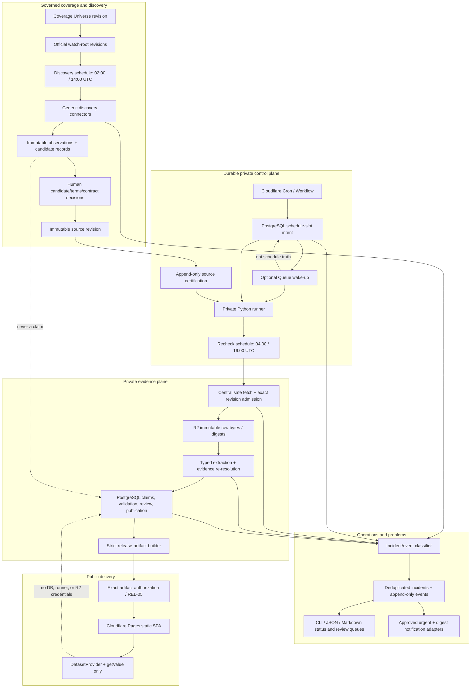

# Continuous benchmark discovery, recheck, and alerting implementation plan

## Planner metadata

- **Repository:** `/srv/hermes/development/ai-benchmark-aggregator`
- **Branch and anchor:** `main` at `b0e33e6`; the workspace was already substantially dirty and must not be reset or treated as a clean baseline.
- **Date:** 2026-07-15 (UTC)
- **Status:** proposed implementation plan; implementation has **not** started.
- **Planning mode:** goal-backed full worker run under Planning Orchestrator, with one parent-owned artifact and three read-only specialist lanes.
- **Worker scopes:** repository/data contracts; Cloudflare scheduling/compute/storage; operations, incident routing, governance, and QA.
- **Product direction already supplied:** launch with Official claims; use Cloudflare Pages for the public static frontend; recover with no more than one scheduled source-capture cycle lost; support as broad a browser and assistive-technology matrix as practical; automate daily work so the owner does not run a Python command for each source.
- **Extends:** [Production launch architecture and release plan](2026-07-14-production-launch-architecture-and-release-plan.md), [Official-mode remediation implementation plan](2026-07-13-official-mode-remediation-implementation-plan.md), and [initial source candidate inventory](../audits/2026-07-15-source-launch-candidate-inventory.md).
- **Primary repository evidence:** `AGENTS.md`, `README.md`, `ledger/README.md`, registries, migrations, source admission and safe-fetch code, ingestion runner, matching, reporting/export paths, tests, ADR-005 through ADR-007, and the source/release/incident runbooks.
- **Assumption:** the first production volume is modest enough that two discovery windows and two recheck windows per day can run with bounded concurrency. The design must scale by adding manifest entries and generic connector families, not a separate daily script per source.

## Executive goal

Build a continuously operated, source-backed benchmark data system that:

1. checks a declared universe of official benchmark owners, repositories, datasets, APIs, and structured result artifacts once or twice per day;
2. discovers new or revised sources, benchmark editions, evaluated systems, and model names without turning discoveries into Official claims;
3. rechecks every currently certified source revision on its approved cadence, snapshots every changed successful response before extraction, preserves raw values, and writes only admissible evidence-resolvable claims;
4. isolates source failures, detects terms/schema/content/identity drift, quarantines unsafe work, and opens a deduplicated incident with a stable tag, owner, severity, and runbook;
5. sends urgent and digest notifications through owner-approved channels while keeping protected source data and credentials out of alerts;
6. produces operator-visible coverage and health evidence, then passes only separately reviewed and published claims into a digest-pinned release artifact for Cloudflare Pages.

This is one manifest-driven operating system, not a collection of commands an owner runs source by source. Humans approve policy, ambiguous identity, publication, and exceptions; automation performs scheduled discovery, safe rechecks, validation, retry, drift comparison, reporting, and notification.

## What “all sources, all models, all benchmarks” means

No system can prove that it found every benchmark or model on the internet. “All” is therefore a bounded, auditable product promise:

> Every item in the current, versioned **Coverage Universe** has an explicit status, evidence trail, last-check time, and next action; every eligible item is processed on schedule; nothing outside that declared universe is implied to be covered.

The Coverage Universe is a revisioned manifest of:

- official benchmark families and owners the product intends to cover;
- official watch roots, such as repositories, release/dataset indexes, APIs, and result-file locations;
- source classes the product accepts, in priority order;
- explicit exclusions and deferrals with reason, owner, and review date;
- target cadence and staleness threshold;
- coverage cohorts used in public and operator reporting.

The system must report separate numbers for `known`, `watched`, `candidate`, `contract_ready`, `certified`, `captured`, `reviewed`, `published`, `deferred`, `terms_blocked`, and `unsupported`. It must never combine these into a misleading “percent of the internet” metric. Adding a new root or benchmark creates a new Coverage Universe revision and does not rewrite historical coverage reports.

## Source-of-truth contract

| Field | Contract |
| --- | --- |
| **Intent** | Automate broad official-source discovery and twice-daily safe rechecking while retaining human policy/publication authority and immutable claim provenance. |
| **Current behavior** | The Python CLI can ingest selected active sources, but live transport is fail-closed; there is no durable scheduler, discovery candidate system, operational lease/job model, drift baseline, incident registry, or notification delivery. All source revisions remain uncertified and the frontend is Demo-only with an unavailable Official artifact. |
| **Expected outcome** | A private scheduled control/data plane creates durable run intents, dispatches generic discovery/recheck jobs, stores immutable observations/snapshots, writes admissible claims idempotently, quarantines anomalies, and exposes CLI/JSON/Markdown health and incident reports. One separately authorized immutable artifact is the only public crossing to Cloudflare Pages. |
| **Truth owner** | Source/reuse and certification: data-governance owner. Coverage universe and benchmark taxonomy: product/data owner. Runtime and recovery: platform operator. Identity review: benchmark-data reviewer. Publication/revocation: release-governance owner. Public display: the exact authorized release artifact. Owners are roles until people are named. |
| **Contract boundary** | Discovery observations and candidates are not source certifications, snapshots, result claims, review decisions, publication decisions, or frontend artifacts. A recheck may enter the claim ledger only through the exact certified immutable source revision and central safe-fetch/admission path. |
| **Displaced path** | Ad hoc manual `python`/CLI runs per source, adapter-owned networking, live ingestion in CI, browser/agent scraping as the authoritative collector, mutable SQLite as a cloud service, candidate/report files as frontend data, and silent default/fallback sources. |
| **Cutover** | Run fixture-only tests, then shadow discovery, then certified-source no-publication rechecks, then recovery/alert drills, then controlled artifact rehearsal. Inventory any manual/system schedule, record its final slot watermark, and disable it only after two full successful new cadence windows plus catch-up/alert evidence. A failed cutover pauses and fences new leases, reconciles exact incomplete slots, and resumes from the same versioned policy without database downgrade/reset. Official mode remains unavailable until REL-05 separately authorizes an exact artifact and frontend release. |
| **Acceptance evidence** | Real schedule-slot/job records, immutable discovery and source bytes with digests, source-revision certification references, evidence re-resolution, duplicate/idempotency proof, drift and failure-injection incidents, notification receipts, recovery receipts, coverage reports, and—only at final release—an exact artifact/decision/digest/frontend authorization. Unit tests and diffs support but do not replace these target-perspective records. |
| **Evidence lane** | Append-only evidence, decision, receipt, and operational-event records in PostgreSQL plus private object storage for raw bytes and artifacts; only fenced lease/heartbeat projections are mutable coordination state. Redacted CLI/JSON/Markdown projections and provider logs are supporting views. The queue and Cloudflare scheduler are not the system of record. |
| **Kill criteria** | Stop a source on uncertain terms/authority, unexpected final URL, unsafe DNS/peer, oversized or wrong-MIME response, schema/dimension drift, lexical score rejection, evidence failure, stale/multiple certification leaves, or snapshot-store failure. Stop platform rollout if append-only invariants, recovery objective, isolation, alert delivery, or cost caps cannot be demonstrated. |
| **Forbidden moves** | Do not auto-certify, auto-review ambiguous identity, auto-publish, recalculate/coerce scores, overwrite claims or decisions, select duplicate eligible cells by order, revive retired/mock/fallback adapters, scrape articles/blogs/social posts into O0, put database/storage credentials in the browser, run live ingestion in PR CI, use D1 as a drop-in ledger, run live SQLite on R2 FUSE, deploy/spend without approval, or enable Official from a candidate projection. |

## Native Planning Superiority

- **Codex Native baseline:** a generic outline would likely say “add cron, scraping, a database, and alerts” without defining what “all” means, separating discovery from claims, binding work to certified revisions, addressing evaluated-system identity, protecting missed schedules, or specifying evidence stronger than tests.
- **What this Planning Orchestrator run does better:** it anchors the live repository and dirty-worktree constraints; incorporates the user's Cloudflare, free-tier, recovery, Official-claim, and accessibility decisions; separates three specialist evidence lanes; defines durable contracts and state machines; gives dependency-ordered tasks with file areas and pass/fail evidence; and hands the first slice directly to an Implementation Orchestrator.
- **User-specific context used:** no one-by-one manual runs; once/twice-daily discovery and recheck; automatic problem tagging; Cloudflare Pages; generous free-tier preference; Official-claims goal; no more than one capture-cycle loss; broad client accessibility.
- **Superiority score target:** 5/5.
- **Proof artifacts:** this durable plan, the recorded worker decision/closeout, repository inventory, current official provider citations, explicit acceptance matrix, and the implementation handoff.

## Orchestration decision

- **Mode:** full worker run.
- **Worker count:** three read-only specialists plus the parent integrator.
- **Decision reason:** the plan spans independent repository/data-contract, scheduled platform, and governance/operations surfaces and must be detailed enough for a later implementation agent.
- **Independent surfaces:** discovery and identity architecture; Cloudflare/private-runner scheduling, compute, storage, and cost; incident taxonomy, alerting, SLOs, recovery, QA, and release operations.
- **Workers used or skipped:** three narrow workers were used. Overlapping UI redesign, browser automation, and user-visible thread workers were skipped because the current task is a private data-platform plan and one parent-owned artifact is the desired output.
- **Thread decision:** keep this work in the current task; no separate user-managed task/worktree is needed.
- **Token/context rationale:** workers received only their evidence lane and prohibitions; the parent retains containment, conflict resolution, document edits, and acceptance ownership.
- **Reconsider trigger:** add a narrowly scoped follow-up only if provider research leaves an unresolved storage, scheduling, recovery, or alert-routing fact that changes the recommended architecture.

## Background browser lane

- **Needed:** no.
- **Target/surface:** none during planning. Official Cloudflare documentation is sufficient for platform decisions; no live source inspection is required to design the generic system.
- **Safety boundary:** Obscura, Cloudflare Browser Rendering, or another browser agent may later act as a discovery scout or rendered-page drift canary only after terms and egress approval. It must not be the authoritative result collector, bypass safe fetch, follow arbitrary links, solve access controls, or generate Official claims.
- **Required receipt:** if later enabled, record exact allowed root, final URLs, browser/runtime version, captured screenshot/DOM digest, request counts, terms decision, cost, and whether the observation was candidate-only.
- **Stop condition:** authentication wall, bot challenge, uncertain terms, unexpected domain, protected/private content, personal data, or any proposal to treat rendered/agent interpretation as the raw official score source.

## Research findings and adopt/adapt/avoid decisions

### Repository and source-method findings

| Finding | Decision |
| --- | --- |
| The ledger already has immutable source revisions, certification decisions, snapshots, raw claims, validation, review/publication decisions, and per-source transaction isolation. | **Adopt:** extend these trust boundaries; do not build a second claim path. |
| `ingest --all` is only a selector over currently active, policy-admissible, certified sources; it is not scheduling or discovery. The default network transport is deliberately disabled. | **Adapt:** place a durable scheduler and approved private transport above the runner, retaining admission immediately before fetch and write. |
| Existing adapters include generic JSON, CSV, HTML-table, GitHub YAML, and multiple source-specific/retired routes. | **Adapt:** standardize reusable connector/locator families and retire source-owned HTTP. A manifest chooses a family; source-specific code is an exception requiring fixtures and review. |
| Exact, case-insensitive, and normalized alias matching exist, while many leaderboard labels can represent an agent, harness, submission, or system rather than a base model. | **Adapt:** add typed evaluated-system identity and append-only mapping decisions; never force an ambiguous system string into `ModelEntity`. |
| Candidate feed and legacy inventory are offline read models, and the Official v2 parser is dormant. | **Adopt:** keep discovery/coverage/incident outputs out of the frontend artifact path; publication remains a later release control. |
| Articles, vendor blogs, newsletters, and social posts are outside O0. | **Avoid:** do not use them as discovery authority or result evidence. They may not seed Official claims. |

### Cloudflare and managed-platform findings

| Surface | Current official capability relevant to this plan | Decision |
| --- | --- | --- |
| Pages | Static asset requests are free/unlimited; Pages Functions count against Workers usage. Current Free limits include 500 builds/month and 25 MiB per individual asset. | **Adopt:** serve the static SPA and exact packaged release artifact from Pages. Keep private collection elsewhere and enforce an artifact-size budget before release. |
| Workers Cron | UTC schedules; Free accounts have five Cron triggers. Scheduled/queue consumers can run up to 15 minutes wall time, but Free Workers have a 10 ms CPU limit and 100,000 requests/day. | **Adapt:** use a tiny scheduler/control function, not Python parsing or ledger transactions. Two lane schedules plus maintenance fit the trigger count. |
| Workflows | Available on Free and Paid, supports scheduled instances, durable steps, retry/backoff, and non-retryable failures. The Free plan is constrained to a 10 ms CPU limit, 3,000 steps/day, 100 MB maximum persisted state, and short default state retention; 1 GB state is a Paid limit. | **Adapt:** suitable for lightweight orchestration receipts and wakeups if tested, but PostgreSQL job records remain authoritative. Recheck pricing before selection because announced billing changes are time-sensitive. |
| Queues | Free includes 10,000 operations/day but only 24-hour message retention; Paid includes a longer configurable retention window. | **Adapt:** optional wake-up transport with idempotent messages. Never rely on the queue to remember a missed scheduled capture. |
| R2 | Standard storage has a useful free tier (10 GB-month, 1 million Class A and 10 million Class B operations, free egress at the cited date). | **Adopt conditionally:** content-addressed immutable source bytes and artifacts, after retention, access, digest, and recovery tests. |
| Containers | Can run arbitrary Linux/Python workloads but require Workers Paid. Container disk is ephemeral; R2 FUSE is not a durable POSIX database disk. | **Adopt for low-cost managed production after budget approval:** run the private Python worker with no public ingress. **Avoid:** SQLite on container disk or R2 FUSE. |
| Browser Rendering | Free allowance is small and per-session/crawl limits are unsuitable for the core collection plane. | **Avoid as primary ingestion:** use only an approved scout/canary when structured sources are unavailable. |
| D1 | Has a free prototyping tier and Time Travel, but its limits, destructive restore semantics, and dialect/runtime differences do not match the current SQLAlchemy/Alembic ledger as a drop-in port. | **Avoid as the production ledger default:** keep the PostgreSQL plan. |

### Recommended cost posture

| Stage | Topology | What it proves | What it cannot claim |
| --- | --- | --- | --- |
| **$0 shadow pilot** | Pages + Free Worker/Workflow + R2 free allowance + an owner-controlled always-on Python runner + a verified free PostgreSQL candidate. | Contracts, fixture replay, twice-daily scheduling, discovery observations, operational reports, and approximate workload/cost. | Managed availability, paid-plan backup/PITR, unattended Official production, or the recovery promise until real drills pass. |
| **Low-cost production (recommended)** | Pages + lightweight Worker/Workflow + optional Queue + R2 + private Python container/job runner (Cloudflare Container is the Cloudflare-native candidate) + managed PostgreSQL with tested backups. | A contained, managed operating path with separate control, compute, relational, object, and public planes. | Authorization to spend or deploy; exact price/region/retention must be approved at implementation time. |
| **Scale tier** | Same boundaries with additional runner concurrency, queue consumers, database/storage capacity, and alerting service. | Horizontal source growth without changing claim semantics. | Permission to weaken per-source rate limits, evidence rules, or human certification/publication. |

There is no credible strictly free, fully managed, production-reliable topology with arbitrary Python compute, durable PostgreSQL, object storage, backups, alerts, and a tested recovery guarantee. Free tiers are appropriate for shadow evidence. Official launch requires either an owner-operated runner with explicitly accepted availability risk or a small approved recurring budget.

## Current state

### Verified inventory on 2026-07-15

| Surface | Current repository fact | Interpretation |
| --- | --- | --- |
| Source registry | 53 unique configured routes: 23 active and 30 inactive. The 23 active cadence labels are 10 daily, 4 weekly, 6 on-release, 1 on-commit, and 2 manual. | Configuration breadth/descriptive cadence only; no scheduler consumes it and none is certified/publishable. |
| Benchmark registry | 42 unique configured benchmarks. | Known catalog seed, not proof of current edition/source coverage. |
| Model registry | 1,189 YAML rows and 1,186 unique IDs; duplicates are `claude_3_7_sonnet`, `deepseek_v3`, and `gpt_4o_mini`. | A large seed catalog with integrity cleanup required; it is not an automatically refreshed model authority. |
| Demo frontend | 23 visible Demo models with synthetic scores. | Publicly useful only while labelled Demo/synthetic. |
| Local SQLite | Historical local data includes quarantined/legacy claims and does not match the current YAML source count. Read-only preflight currently reports `invalid` with 2,715 foreign-key violations from orphaned validation references. | Quarantined local operational evidence only; not migration-ready, an Official launch dataset, or current configuration authority. Preserve it read-only. |
| Source admission | No effective source-revision certification; default network transport disabled. | Correct fail-closed containment. No scheduled live recheck can start yet. |
| Ingestion | Per-source savepoints, source snapshot/claim idempotency, central evidence admission, and an `IngestionRun` summary exist. | Strong core to reuse, but coarse run metadata is not a durable scheduler/incident system. |
| Storage | File-backed SQLite and local content-addressed snapshot storage. | Suitable for local evidence; requires a PostgreSQL/object-store port and recovery proof. |
| Official feed | `src/data/official/export.unavailable.json` is the only runtime input; v2 remains dormant. | No candidate, discovery report, or ledger query may turn Official on. |

### Current gaps that determine sequencing

- No versioned Coverage Universe or watch-root registry defines the product's bounded breadth.
- No discovery observation/candidate/decision schema separates “found” from “approved source.”
- No benchmark-edition or evaluated-system identity layer models leaderboard versions and agent/harness submissions safely.
- No durable schedule slot, lease, attempt, retry classification, catch-up, or dead-letter record exists.
- No source-contract schema covers final-URL allowlists, typed locator/evidence contract, terms decision, size/MIME/time bounds, cadence, and drift baselines in one reviewable unit.
- No object-store/PostgreSQL production implementation or private live transport is approved.
- No stable incident taxonomy, acknowledgement lifecycle, notification delivery record, or owner-visible daily digest exists.
- No real twice-daily shadow run, missed-cycle recovery drill, alert failure drill, or multi-source load/cost receipt exists.
- No source is certified; BigCodeBench and SWE-bench Verified remain candidates and ARC-AGI is terms-deferred.

## Future state architecture



### Plane boundaries

1. **Coverage plane:** declares what the product watches and reports omissions honestly.
2. **Discovery plane:** records official-root observations and candidates; it has no claim or publication authority.
3. **Control plane:** owns durable schedule intent, leases, attempts, catch-up, and operational state.
4. **Evidence plane:** admits only exact certified revisions, snapshots before extraction, and preserves immutable raw/evidence/decision chains.
5. **Operations plane:** turns abnormal conditions into incidents and delivery receipts without changing evidence.
6. **Publication plane:** builds a deterministic eligible artifact after human review/publication and permits exactly one authorized artifact to cross into Pages.

### Default cadence

| Lane | Default UTC schedule | Behavior |
| --- | --- | --- |
| Discovery | `02:00` and `14:00` | Check due watch roots with conditional metadata requests, record new/revised observations and candidates, compare catalog/terms/schema signals, and open exceptions. It never writes result claims or certifications. |
| Recheck/capture | `04:00` and `16:00` | Process due, active, currently certified source revisions only. Enforce per-source cadence/terms/rate limits; snapshot every changed `200` response before parse; record an unchanged check for valid `304`; validate and re-resolve evidence before claim insertion. |
| Digest and maintenance | after the second recheck, proposed `18:00` | Produce a redacted coverage/health/incident digest, find stale leases and missed slots, verify notification delivery, and schedule bounded catch-up. |

The scheduler wakes twice daily, but an individual source may be checked less often when its terms, publication cadence, or rate limit require it. No source may be checked more often merely because the global scheduler runs. A missed slot remains durable and is caught up; it is never recreated by guessing from queue history.

### Discovery coverage streams

| Stream | How candidates are found | Candidate output | What it does not prove |
| --- | --- | --- | --- |
| Benchmark/owner | Governed official organization sites, repositories, dataset organizations, release indexes, and correction/contact pages. | Benchmark family/edition and owner candidates, official roots, lifecycle/supersession signals. | That an official result artifact exists or may be reused. |
| Result source | Approved official APIs, revisioned repository files/releases, dataset file manifests, object-store indexes, CSV/JSON/Parquet assets, and structured official pages. | Source/artifact candidate with revision, format, completeness, terms, locator, and parser hints. | Certification, completeness, score admissibility, or publication. |
| Model metadata | Governed first-party provider model catalogs/cards/docs and official artifact repositories. | Model/version/endpoint metadata candidate and provenance. | That a leaderboard raw label refers to that candidate. |
| Evaluated system | Exact raw labels and configuration fields observed in a certified complete result snapshot. | Identity/evaluation-subject work item tied to source evidence. | Base-model identity when the source reports an agent, harness, ensemble, or opaque submission. |
| Operator lead/correction | A manually supplied official URL or correction request, screened through the same allowlist/terms/candidate process. | Candidate with submitter-independent official evidence. | Permission to skip discovery, certification, or review gates. |

Terms pages may be monitored automatically only when that access itself is permitted. Otherwise the contract creates calendar review reminders and requires a human terms check; a crawler must not violate terms in order to detect a terms change.

## Core contracts and state models

All durable schema work follows forward-only Alembic migrations. `init-db` remains empty-database-only. Any migration rehearsal uses a verified disposable copy, retains the original SQLite backup/read-only source, and restores into a new target rather than downgrading or deleting.

### Coverage and discovery records

| Record | Minimum fields and invariants | Authority |
| --- | --- | --- |
| `CoverageUniverseRevision` | ID, canonical digest, effective time, scope/cohort definitions, required source classes, approved exclusions, author/decision reference, superseded revision. Immutable. | Defines bounded “all”; cannot certify or publish. |
| `DiscoveryTargetRevision` | Logical owner/root ID, official origin, connector/version, allowed hosts/final URL patterns, due policy, terms-review locator/status, correction route, size/request budget, superseded revision. | Permits candidate reconnaissance only. |
| `DiscoveryRun` | Universe revision, scheduled slot, connector build, expected/due targets, terminal dispositions, canonical receipt digest. | Proves the discovery cycle ran. |
| `DiscoveryObservation` | Target revision, immutable observation-object digest/URI when bytes are retained, observed revision/commit, structured format, schema fingerprint, first/last seen, canonical locator, redacted fetch facts. | Evidence that something was observed; never a result snapshot. |
| `DiscoveryCandidate` | Type (`benchmark`, `source`, `model_metadata`, `evaluation_subject`), stable fingerprint, owner, official URLs, candidate format/revision, terms/completeness/parser hints, state, affected benchmark. | Quarantined proposal. |
| `DiscoveryCandidateDecision` | Append-only event with expected prior decision, outcome, reason, actor, evidence refs, and superseding link. | May reject, defer, or authorize contract drafting; never certifies a source directly. |

Candidate lifecycle:

```text
observed
  -> auto_screened
  -> needs_governance
  -> contract_draft
  -> fixture_verified
  -> certification_pending
  -> approved_as_source_revision

terminal/side states:
  rejected_nonofficial | rejected_unstructured | blocked_terms
  blocked_permission | blocked_incomplete_artifact | unsupported_format
  superseded | retired
```

Every transition is explicit. Discovery must not edit an active source projection, construct a `ResultClaim`, append a certification/publication decision, or enable a schedule for capture.

### Source contract revision

Each capture-eligible source revision must carry or reference one canonical, schema-validated contract containing:

- logical source, benchmark, owner, officialness, terms/reuse review, decision/evidence dates, expiry/review date, and correction route;
- immutable artifact locator or an explicitly approved mutable endpoint plus revision-discovery rules;
- exact approved full request URLs and exact approved full final URLs for capture, plus host-level egress allowlists as defense in depth; redirect policy, authentication class, TLS/peer requirements, request method, conditional-request policy, and source-specific rate/concurrency limits;
- accepted MIME types, maximum bytes, timeout, row/record/shard limits, completeness rule, and expected cardinality range;
- adapter/connector name and version, structured locator family, raw-field map, typed `evidence_location` schema, and parser fixture digest;
- approved benchmark, metric, split, setting, evaluation version, score unit, and numeric lexical policy;
- explicit record exclusions, each with a governed reason; unexplained loss is forbidden;
- schema fingerprint policy, drift tolerances, change-rate/cardinality baselines, freshness/cadence, retry classification, and incident owner/runbook;
- exact certification-decision linkage and canonical contract digest.

Source-method priority is:

1. approved official result API;
2. revision-pinned official JSON/CSV/Parquet or repository release artifact;
3. approved official dataset/file manifest or spreadsheet export;
4. deterministic official HTML/embedded structured data with a typed locator;
5. browser-rendered reconnaissance/canary only, never authoritative claim extraction.

An endpoint that is easier to scrape but incomplete, mutable without history, unofficial, preview-only, derived, or terms-uncertain is rejected even if its rows look useful.

### Source-revision proposal, certification, and cutover

Discovery and registry reconciliation must use a two-phase path:

1. create an immutable proposed `OfficialSourceRevision`/proposal record without changing `OfficialSourceRow.current_revision_id` or its active schedule;
2. validate the exact contract, fixtures, authority/terms, exact request/final URLs, evidence locators, dimensions, actor authority, review/expiry dates, and supersession relationship;
3. append one linear `SourceRevisionDecision` for the proposed revision (`certified`, `quarantined`, or `revoked`) through a deliberately governed service—the current repository's certification prohibition must not be bypassed ad hoc;
4. after effective certification, atomically append/select a current-revision cutover record and its schedule policy while rechecking the same certification inside the transaction;
5. retain the prior revision, decisions, snapshots, claims, and receipts. A failed new revision is quarantined/revoked; selecting a previously certified revision again requires a new explicit cutover decision, never a database rollback.

A newly discovered proposal must not interrupt a healthy certified current revision. A terms/security/evidence failure on the current revision may pause it immediately through the separate incident/governance path, but the existence of a successor proposal is not itself a pause or cutover authority.

### Schedule, job, lease, and receipt records

| Record | Purpose | Key invariant |
| --- | --- | --- |
| `SchedulePolicyRevision` | Version cadence, jitter, staleness, host budget, retry window, enable/pause reason. | Source capture policies bind exact source revision and certification decision. |
| `ScheduleCycle` | One logical lane/environment/scheduled-slot receipt, including expected and terminal disposition counts. | Unique canonical identity; a duplicate trigger returns the existing cycle. |
| `JobIntent` | One discovery-target or source-revision job for the slot. | Unique `(environment, lane, target_revision_id, scheduled_for, policy_revision_id)`. |
| `JobAttempt` | Immutable attempt number, worker identity hash, start/end, stable outcome/cause, retry time, receipt digest, and typed output references. | No raw exception, source bytes, headers, score/model strings, credentials, or secret URLs. |
| `Lease` | Mutable coordination row with expiry, heartbeat, owner hash, and monotonic fencing token. | An expired/stale worker cannot commit after a newer token exists. |
| `SourceCheckReceipt` | Exact certification checked, conditional-fetch result, snapshot digest/reference, extraction counts, validation/review counts, and terminal disposition. | A scheduled source never disappears because no source was admitted; blocked/skipped is still observable without a misleading ingestion run. |

Cycle identity is a canonical digest of environment, lane, scheduled slot, and schedule-policy revision. Job messages contain only opaque IDs and the deterministic idempotency key. Queue delivery is expected to be at least once; duplicate delivery is normal, while duplicate logical work is a defect.

Recheck lifecycle:

```text
scheduled -> leased -> revision_admitted -> fetch_started
  -> not_modified -> completed_unchanged
  or
  -> bytes_received -> snapshot_committed -> schema_checked
  -> extraction_accounted -> claims_admitted
  -> completed_changed | completed_with_review

failure/containment:
  retryable_failed | policy_blocked | terms_quarantined
  schema_quarantined | snapshot_integrity_failed
  extraction_incomplete | identity_review_required
  display_conflict | operator_paused
```

### Extraction accounting

Adapters must return a versioned `ExtractionBatch`, not an unaccounted list of claim candidates. It includes:

- source records/rows observed;
- rows parsed;
- claim candidates emitted;
- admitted, explicitly excluded, rejected, and quarantined counts;
- schema fingerprint and parser/contract version;
- evidence-locator coverage;
- unexplained/duplicate record diagnostics;
- canonical batch receipt digest.

For a complete source artifact, every record must be accounted for. Zero results, unexpected row-count collapse, missing required dimensions, duplicate locator targets, unapproved exclusions, or totals that do not balance quarantines the entire batch for claim insertion. The already stored raw snapshot remains preserved.

The transaction boundary must make that preservation real: after a certified fetch, the application stores and re-reads the raw object, then commits the `SourceSnapshot` and check/snapshot receipt in a durable evidence transaction before it begins schema/extraction/claim work. Extraction and claim insertion run in a separate linked transaction/savepoint. A later schema, evidence, or claim-batch failure appends a quarantine receipt and rolls back unsafe claims, not the snapshot row. If object storage succeeds but the snapshot transaction fails, the object remains an explicit orphan and an idempotent retry may adopt it by exact revision/digest after verification.

### Benchmark and evaluated-system identity

The current `Benchmark` and `ModelEntity` seeds are not sufficient to describe every leaderboard row safely.

Add a logical benchmark plus immutable edition/definition revision model that distinguishes:

- benchmark family and owner;
- benchmark edition/version and supersession;
- suite/subset or task;
- metric and unit;
- split;
- evaluation setting;
- evaluator/harness version;
- result/source scope and effective dates.

Add an evaluated-subject layer that distinguishes:

- a single model/version or endpoint;
- an agent + model + harness/system configuration;
- an ensemble or routed system;
- a benchmark submission with insufficient component detail;
- unknown.

`ResultClaim.model_raw` and every other raw source field remain unchanged. To preserve the frontend's required `getValue(modelId, benchmarkId)` and the existing six-dimension identity, the recommended implementation treats the top-level evaluated subject as a typed `ModelEntity`: add reviewed entity types such as `agent_model_system`, `ensemble`, and `submission`, plus component relationships to actual model/harness entities. A publishable claim's `model_entity_id` points at that top-level typed subject, not falsely at one component model. A separate `EvaluationSubject` subtype is acceptable only if it has a one-to-one stable `ModelEntity` display identity. Unmatched or ambiguous strings create one deduplicated identity work item and retain a null canonical ID. First-party model catalogs may enrich metadata candidates but never prove that a leaderboard label maps to that model.

Identity resolution order remains exact, case-insensitive, then normalized; any collision at the first matching priority fails ambiguous. Alias changes need provenance and append-only review events. The current local database already contains 84 exact alias collision keys—83 model aliases and one benchmark alias (`LiveCodeBench` also points at BigCodeBench)—so collision inventory and correction are a foundation task, not an assumption that matching is clean.

### Operational incidents, work items, and notifications

Use append-only incident/work-item event chains with deterministic read projections. Do not overload claims, review decisions, arbitrary run metadata, or GitHub issues as the primary incident database.

Minimum incident fields:

- stable incident ID and fingerprint;
- `incident_code` and existing lower-level cause/reason code;
- severity, environment, owner role, optional assignee, state, and SLA timestamps;
- typed affected IDs (cycle, job, source, source revision, benchmark, artifact), never raw source-controlled tags;
- occurrence count, first/last occurrence, expected prior event, containment refs, runbook, and next action;
- target-perspective resolution evidence;
- append-only acknowledgement, mitigation, resolution, closure, and reopen events.

Incident lifecycle:

```text
OPEN -> ACKNOWLEDGED -> INVESTIGATING -> MITIGATED -> RESOLVED -> CLOSED
  ^                                                              |
  +--------------------------- REOPENED ---------------------------+
```

`paused`, `quarantined`, `revoked`, and `withdrawn` are separate containment/governance actions with decision references; they are not incident states.

Recommended stable families and representative codes:

| Family | Examples | Default response |
| --- | --- | --- |
| `DISCOVERY` | `NEW_CANDIDATE`, `CANDIDATE_DRIFT`, `ORIGIN_UNREACHABLE`, `DUPLICATE` | Candidate/review queue; never activate automatically. |
| `SOURCE_POLICY` | `TERMS_UNKNOWN`, `TERMS_CHANGED`, `PERMISSION_REQUIRED`, `CERT_EXPIRED`, `REVISION_UNCERTIFIED` | Pause future fetch; governance review or append-only revocation/supersession. |
| `FETCH` | `TRANSPORT_UNAVAILABLE`, `TRANSIENT`, `RATE_LIMITED`, `POLICY_BLOCK`, `CONTENT_MISMATCH`, `UNSAFE_REDIRECT` | Retry transient only; unsafe/policy cases stop immediately. |
| `SNAPSHOT` / `STORAGE` | `WRITE_FAILED`, `HASH_MISMATCH`, `OBJECT_MISSING`, `RETENTION_VIOLATION`, `ORPHAN_DETECTED` | Preserve known objects/orphans; stop dependent claim/publication paths. |
| `SCHEMA` / `EVIDENCE` | `SCHEMA_DRIFT`, `LOCATOR_UNRESOLVABLE`, `RAW_VALUE_MISMATCH`, `CONTRACT_MISMATCH` | Retain snapshot, insert zero claims for the batch, pause source, open contract review. |
| `VALIDATION` | `CLAIM_REJECTED`, `NO_PASS`, `NONFINITE_SCORE`, `DIMENSION_UNAPPROVED` | No coercion/publication; typed review queue. |
| `IDENTITY` | `MODEL_UNRESOLVED`, `MODEL_AMBIGUOUS`, `BENCHMARK_UNRESOLVED`, `SYSTEM_COMPOSITION_UNKNOWN` | Keep raw, null ID, one review item. |
| `CONFLICT` | `DISPLAY_CELL_DUPLICATE`, `DECISION_CHAIN_AMBIGUOUS`, `FINGERPRINT_COLLISION` | Fail the whole candidate/artifact; never choose by order. |
| `SCHEDULER` | `DISPATCH_MISSED`, `LEASE_LOST`, `DUPLICATE_DELIVERY`, `QUEUE_BACKLOG`, `WATCHDOG_MISSING_RECEIPT` | Reconcile from durable slots; fence retry; promote on consecutive miss. |
| `DATABASE` | `UNAVAILABLE`, `CONSTRAINT_FAILED`, `MIGRATION_FAILED`, `RESTORE_FAILED` | Stop writes/promotion; recover into a new verified target. |
| `ARTIFACT` / `PUBLICATION` | `BUILD_FAILED`, `DIGEST_MISMATCH`, `UNAUTHORIZED`, `REVOCATION_FAILED`, `WITHDRAWAL_FAILED` | Stop promotion or serve explicit unavailable/withdrawn state. |
| `FRONTEND` | `ARTIFACT_LOAD_FAILED`, `AUTHORIZATION_MISMATCH`, `CACHE_STALE`, `SILENT_FALLBACK_ATTEMPT` | Never relabel Demo as Official; explicit failure/withdrawal. |
| `SECURITY` | `CREDENTIAL_EXPOSURE`, `UNSAFE_EGRESS`, `PRIVACY_POLICY_VIOLATION`, `ALERT_INJECTION` | Disable path/identity, preserve evidence, rotate and assess. |
| `NOTIFY` | `DELIVERY_FAILED`, `DEAD_LETTERED`, `WATCHDOG_FAILED` | Use approved fallback; prevent recursive alert storms. |

Proposed severity response targets, subject to named owner/on-call approval:

| Severity | Meaning | Acknowledge | Mitigate/contain |
| --- | --- | --- | --- |
| `SEV0` | Wrong Official bytes publicly exposed, evidence loss/corruption, credential/privacy breach, or unsafe egress. | 15 minutes | 1 hour; public withdrawal remains no later than 4 hours. |
| `SEV1` | Pipeline-wide outage, second consecutive missed cycle, restore failure, or published-source terms/evidence failure. | 30 minutes | 4 hours. |
| `SEV2` | One-source/schema/review-blocking anomaly or first missed cycle. | 4 business hours | 2 business days. |
| `SEV3` | New candidate, identity ambiguity, or nonurgent maintenance. | 1 business day | 5 business days. |

Proposed review-work-item defaults:

| Class | Initial owner | Due target | Terminal action |
| --- | --- | --- | --- |
| Source candidate | Discovery/data governance | 5 business days | Reject, defer with review date, or advance to contract draft. |
| Terms/certification | Data governance | Immediate pause; human action within 1 business day or before expiry, whichever is earlier | Superseding decision, explicit deferral/block, or revocation. |
| Source contract/evidence drift | Ledger/source owner | 2 business days | New reviewed revision/fixture/contract or continued quarantine. |
| Model/system identity | Model-registry steward | 2 business days | Append identity decision or explicitly retain unresolved. |
| Validation | Ledger reviewer | 2 business days | Append validation-review decision or continued rejection. |
| Display conflict | Ledger/release owner | 2 business days and always release-blocking | Append decisions that remove ambiguity, or keep the artifact blocked. |
| Publication/artifact | Publication/release signer | Release-specific deadline and always release-blocking | Approve/quarantine/revoke exact inputs; no timeout approval. |
| SEV0/1 follow-up | Incident owner | Date recorded in the post-incident event | Evidence-linked completion or an explicit overdue escalation. |

`business_calendar_id` and timezone are required owner decisions; until approved, SLA output is provisional. The clock does not silently pause: waiting on an external party becomes an explicit terminal deferral/block with a new review date. The 95% objective is calculated per class and overall over a rolling 90-day window as on-time terminal actions divided by all items whose due time occurred; merged duplicates before SLA start are excluded, zero denominators report `not_applicable`, stored fractions are not rounded for pass/fail, and publication-blocking status always overrides the percentage.

Machine tags use stable IDs only, for example `area:schema`, `sev:2`, `state:open`, `owner:data-governance`, `source:bigcodebench`, `cause:EVIDENCE_VALUE_MISMATCH`. Raw model names, scores, source content, query strings, filesystem/object paths, and credentials are forbidden in tags and payloads.

Notifications use a transactional outbox. Incident transition and notification intent commit together; asynchronous delivery records adapter/template version, payload digest, safe provider message reference, attempts, result, and dead-letter state. Notification delivery never changes incident or evidence status by itself.

Initial operator surface remains CLI-only with JSON and Markdown projections:

```text
benchmark-ledger coverage status --format json
benchmark-ledger discovery run --due
benchmark-ledger discovery candidates list/show
benchmark-ledger schedules due
benchmark-ledger recheck run --due
benchmark-ledger cycles list/show
benchmark-ledger ops status
benchmark-ledger ops incidents list/show/acknowledge/transition
benchmark-ledger ops reviews list/claim/resolve
benchmark-ledger ops notification-receipts
```

External adapters are disabled until P0-07 authorizes data minimization, secrets, recipients, retention, authentication, and ownership. Planned order is local JSON/stdout, then two failure-independent urgent routes—typically a private email route from the independent watchdog and a private Slack/Discord route from the primary outbox—followed by optional GitHub issue and pager integrations. With only one route the system remains supervised/shadow-only. A GitHub issue is a delivery/read-model target, never the incident source of truth.

### Retry and pause policy

Retry at most three attempts inside one logical slot for explicitly transient failures: timeout, connection reset, approved `429`/`5xx`, object-store service unavailability, and database serialization/deadlock. Respect a safe `Retry-After`; otherwise use bounded exponential backoff with jitter that ends before the next scheduled slot.

Never auto-retry terms/certification failure, unsafe URL/DNS/peer/redirect, MIME/size/contract mismatch, schema/evidence drift, invalid/nonfinite numeric lexeme, identity ambiguity, duplicate display conflict, digest/missing-object failure, or security/privacy violation. Recovery from these requires the appropriate reviewed contract/decision path, not a later successful HTTP response.

### Drift detection

Record typed, versioned baselines per certified source revision:

- HTTP content type, final-host set, object size, ETag/Last-Modified behavior;
- top-level schema/key and locator fingerprints;
- shard/file count, row count, parsed/admitted/excluded/rejected counts;
- metric/split/setting/evaluation-version sets;
- raw model-label count, new/removed label rate, duplicate rate;
- numeric lexeme class and approved range/unit diagnostics;
- content-change frequency and last successful compliant check.

An anomaly score may prioritize review but cannot normalize data, alter a raw value, decide a benchmark identity, or publish. Breaking schema/evidence/terms drift is deterministic and quarantines. Statistical deviations are warnings until reviewed.

## Reliability, recovery, and service objectives

These are proposed launch targets. They become promises only after accountable owners approve them and real provider drills prove them.

| Objective | Proposed target | Evidence required |
| --- | --- | --- |
| Schedule-intent completeness | 99.9% of due targets receive exactly one durable job intent within five minutes of the slot. | Real PostgreSQL cycle/job identities and reconciliation receipts; duplicates and missing intents are failures. |
| Terminal accounting | 99.5% of due jobs receive a terminal receipt within their contract's completion window (default two hours). | Receipts balance every due job, including explicit failures/blocks. This proves accounting, not successful collection. |
| Compliant-check success | 99% of due certified source jobs finish `completed_unchanged` or `completed_changed` within their completion window, both per source and fleet-wide. | Exact compliant outcomes; retry-exhausted, blocked, stale, quarantined, late, or missing receipts are failures. |
| Consecutive misses | No certified source misses two consecutive due cycles. | Independent watchdog plus delivered incident; a second missed 12-hour cycle is SEV1. |
| Capture RPO | No more than one source cadence slot; 12 hours for twice-daily sources. | After-cycle database backup/checkpoint, durable R2 bytes/manifest, and timed restore. A daily DB backup alone is insufficient. |
| Control-plane RTO | Proposed four hours; maximum eight hours unless owner explicitly accepts otherwise. | Timed new-target restore, runner redeploy, catch-up, and evidence re-resolution. |
| Public withdrawal | Four hours or less for a wrong/revoked Official artifact; target one hour for SEV0 mitigation. | Artifact revocation, Pages rollback/cache verification, and public explicit unavailable/withdrawn evidence. |
| Source freshness | Relative to each exact schedule policy: healthy through `next_due_at`; warning during its approved `completion_grace` (default two hours for a 12-hour source); stale/SEV2 after the grace or one missed due cycle; SEV1 after two consecutive missed cycles. | Coverage/freshness report includes cadence, next due, grace, last compliant check, and misses per source. Publication age is separate. |
| Urgent notification | 99.9% of SEV0/1 conditions reach at least one of two approved failure-independent routes in five minutes; both routes remain configured and canaried. | Primary transactional outbox plus external expected-heartbeat monitor and delivered simultaneous-failure drill. Not claimable while only one route is authorized. |
| Review backlog | 95% completed within class SLA; publication-blocking work has no bypass. | Work-item event chain and SLA report. |
| Integrity/privacy | Zero tolerated wrong digest, silent Official fallback, unauthorized publication, protected content/credential in alerts, or claim overwrite. | Negative controls, target logs/payloads, database constraints, artifact/browser proof. |

The independent watchdog must not share the runner's only failure domain. It checks for absent cycle receipts, stale heartbeats, missed backups, notification canary failure, queue backlog, and stale leases. A source state that changed during an outage before any snapshot was captured may be unrecoverable; the system records a coverage gap rather than fabricating historical bytes.

All availability/error-budget objectives use a rolling 90-day UTC window. The denominator includes jobs due while the source revision was effective and certified at the slot; `not_due` is excluded, while a certification/terms/policy failure discovered at execution counts as an unsuccessful compliant check. Only maintenance recorded before the slot with an owner, scope, and expiry is excluded and reported separately. Store exact integer numerators/denominators and compare unrounded fractions. Both fleet and every-source objectives must pass; the worst source and the hard consecutive-miss rule take precedence over a healthy fleet aggregate. Exhaustion freezes onboarding and publication changes until remediation and a successful drill.

For unattended production, the watchdog also needs an expected-heartbeat monitor and urgent route outside the runner, PostgreSQL, and primary Cloudflare account/control-plane failure domain. The transactional outbox remains authoritative when PostgreSQL is healthy; the external watchdog carries only opaque environment/slot health and exists solely to report that the primary system stopped producing receipts.

Backup and recovery rules:

1. acknowledge a changed capture only after immutable object bytes can be read back by SHA-256, the database transaction commits, and the canonical check receipt exists;
2. checkpoint/logically back up the relational state after every completed twice-daily cycle or otherwise prove an equivalent ≤12-hour RPO;
3. retain a locked digest manifest and an independently restorable object copy in a separate failure domain for referenced R2 objects and release artifacts; a manifest without bytes is not a backup;
4. restore into a new PostgreSQL target and restore/verify objects from the recovery copy, retain the old targets read-only, then verify constraints, counts, decision chains, snapshot/object digests, and an approved artifact;
5. never use downgrade/delete/reset or overwrite an old artifact as recovery.

## Security, privacy, and cost controls

- The private runner has no public ingress, distinct migrator/runner/reviewer/builder/read-only roles, an approved secret store, and per-source egress allowlists.
- Central safe fetch must prove both preflight DNS policy and the connected TLS peer/final destination; container host allowlisting is defense in depth, not a substitute for peer proof.
- Prove database connectivity separately for runtime, schema migration, logical backup, and restore. For a Supabase candidate this includes direct versus session/transaction pooler selection, IPv4/IPv6 and port reachability, TLS verification, SQLAlchemy/prepared-statement behavior, pool/concurrency limits, and least-privilege roles. Cloudflare Container restricted egress cannot be assumed to reach PostgreSQL ports; if the exact safe path cannot be proved, choose another private runner/connectivity design rather than weakening network controls.
- Queue messages contain opaque identifiers only. R2 object names are content-addressed or opaque and never exposed to browsers or alerts.
- R2 bucket locks/ACLs and application SHA-256 checks are separate controls. The runner token cannot change lock/lifecycle policy or delete/overwrite retained objects; an administrative token is separately controlled. Application receipts prove digest read-back, while the independent object recovery copy proves recoverability if R2 data is lost or misconfigured.
- Source-controlled strings are escaped and excluded from tags. Arbitrary exception strings never become durable telemetry; map them to stable codes plus a redacted operator detail.
- Pages/preview builds receive no database, R2 private bucket, queue, runner, or service-role credentials. Preview content remains Demo/unavailable unless a separate governed non-public artifact process is approved.
- Do not automatically delete immutable evidence to remain under a free-tier quota. Alert at 70%, freeze source onboarding at 85%, and require an owner decision before exceeding a cap.
- Provider dashboards support diagnosis but are not the sole incident/notification system. Provider limits and prices are rechecked at the decision and pre-launch gates.
- CI remains fixture/contract/build verification only; no live discovery, source capture, production DB write, secret, or publication.

## Non-goals

- Running benchmarks, recomputing scores, averaging/ranking as ledger truth, or validating scientific correctness beyond recording what an approved source reported.
- Claiming universal internet coverage or crawling arbitrary search results, articles, blogs, newsletters, social posts, access-controlled pages, or terms-prohibited surfaces.
- Removing the need for exact source-revision certification, ambiguous identity review, claim validation/review, publication decisions, or release authorization.
- Building a ledger web administration UI or public mutable scores/claims API for the initial launch.
- Migrating, repairing, deleting, or promoting the invalid legacy SQLite database as part of this continuous-system build.
- Replacing the Demo dataset, importing an Official v2 artifact, or enabling Official mode before the governed artifact/release phases.
- Provisioning Cloudflare/Supabase resources, spending money, creating credentials, sending alerts, fetching sources, or deploying during this planning task.

## Phase plan

The phases are dependency gates, not a promise to implement everything in one run. Work can proceed in parallel only where ownership and file surfaces do not overlap. Each task needs a focused implementation goal, reviewed diff, target evidence, an append-only implementation receipt, and an update to the local model guideline ledger when delegation is used.

### Phase 0 — decisions, baseline, and bounded coverage

| ID | Work | Likely areas | Acceptance evidence | Depends on |
| --- | --- | --- | --- | --- |
| `OWN-01` | Name product/data-governance, platform/on-call, ledger-review, model-registry, security/privacy, release-signer, and frontend owners. Approve alert recipients, escalation, RPO/RTO, retention, region, provider and cost authority. | Launch charter, ADR/runbooks | Recorded owner decisions and simple contact/escalation matrix. No provider action implied. | None |
| `COV-01` | Define Coverage Universe v1, cohorts, required official roots/source classes, completeness vocabulary, exclusions, refresh/review policy, and public wording. Seed it from the 42 benchmarks and 53 routes without claiming certification. | `docs/contracts/*`, registry/reporting docs, new schema | Canonical fixture validates; a report accounts for every baseline benchmark/route with one status and reason. | `OWN-01` for final approval; drafting may start earlier |
| `INV-01` | Produce a deterministic baseline census and remediation report for duplicate model IDs, 84 exact alias collision keys, benchmark alias contamination, source-registry/database divergence, and the invalid legacy SQLite database. Quarantine—not repair—the 2,526 legacy claims and 2,715 orphaned validation references until a governed reconciliation path exists. | `ledger/app/reporting/*`, registry validation, tests, audit doc | Read-only report digest; all YAML rows/IDs and local records accounted for; no claim/validation/alias mutation. | None |
| `GOV-06` | Define source authority, terms/reuse, certification expiry/review, correction intake, browser-reconnaissance, model-metadata, and source-retirement policy for continuous discovery. | ADR-005 addendum/new ADR, certification runbooks | Owner-approved decision template and stable reason codes; ARC remains blocked absent written permission. | `OWN-01` |
| `THR-02` | Threat-model discovery roots, SSRF/redirect/DNS rebinding, source-controlled alert injection, queue replay, lease theft, object overwrite/delete, secret boundaries, artifact substitution, and operator acknowledgement. | Security ADR/runbook | Reviewed data flow and abuse-case matrix with owner and kill condition for every high-risk path. | `OWN-01`, architecture choice |

**Phase 0 exit:** bounded “all” is machine-readable and every authority/recipient/provider decision is either approved or explicitly blocking. No live transport, source certification, provider resource, claim, or Official artifact is created.

### Phase 1 — canonical contracts and forward-only schema design

| ID | Work | Likely areas | Acceptance evidence | Depends on |
| --- | --- | --- | --- | --- |
| `COV-02` | Implement schemas for `coverage-universe-v1`, `coverage-census-v1`, `discovery-target-v1`, and `discovery-candidate-v1`; include canonicalization and self-consistency rules. | `docs/contracts/`, new ledger schema modules/tests | Valid fixtures are deterministic; missing denominators, duplicate IDs, mutable timestamps in canonical digests, and unreasoned omissions fail. | `COV-01` |
| `SRC-02` | Define `source-contract-v2` and `source-check-receipt-v1`, including certification binding, exact approved request/final URL allowlists, locator/evidence family, completeness accounting, safe-fetch bounds, schedule, terms dates, drift policy, and correction route. | `docs/contracts/`, `ledger/app/schemas/*`, admission tests | Contract fixtures for JSON/CSV/Parquet/HTML; invalid terms, exact request/final URL, host egress, MIME/size, dimensions, locator, or certification refs fail before network/write. | `GOV-06`, `COV-02` |
| `BMR-01` | Design immutable benchmark definition/edition revisions and supersession, preserving the six existing display dimensions and preventing silent edition collapse. | ADR/domain doc, `models.py`, migration design, registry schemas | Examples cover benchmark rename, new edition, suite/subset, metric changes, and old claim retention without rewrite. | `COV-01` |
| `IDN-01` | Design `EvaluationSubject`, component links, identity candidate/decision chains, alias provenance, and collision handling. Keep raw source identity immutable. | ADR/domain doc, models/migration design, matching tests | Fixtures cover base model, versioned endpoint, agent+model+harness, ensemble, exact collision, normalized collision, unmatched and superseded identities. | `INV-01` |
| `SCH-01` | Define `scheduled-cycle-v1`, job/attempt/lease/fencing/check receipt, deterministic slot calculation, catch-up, retry classes, and canonical receipts. | contracts, models/migration design, scheduler tests | Time-zone/DST-independent UTC fixtures; duplicate trigger and stale-worker traces have one logical job and fenced commits. | `COV-02`, `SRC-02` |
| `INC-01` | Define `ops-incident-v1`, review-work-item, notification-intent/receipt, stable taxonomy, fingerprint, redaction, severity, state transitions, and SLA calculation. | `docs/contracts/*`, incident runbook, schema tests | Canonical fixtures; stale/branched transition rejected; repeated occurrence reopens/deduplicates; source-controlled payload injection is escaped/omitted. | `THR-02`, `OWN-01` |

**Phase 1 exit:** contracts can be implemented without guessing semantics, and a migration design demonstrates that discovery/operations records cannot bypass source certification, claim admission, review, publication, or frontend containment.

### Phase 2 — PostgreSQL, object storage, and operational persistence

| ID | Work | Likely areas | Acceptance evidence | Depends on |
| --- | --- | --- | --- | --- |
| `DATA-07` | Complete the PostgreSQL dialect/constraint port for existing ledger tables and roles. Preserve append-only triggers, effective decision chains, unique cell/conflict behavior, and copy-only migration semantics. | `ledger/app/db/*`, Alembic revisions, real PostgreSQL tests | Fresh and upgrade paths pass on disposable PostgreSQL; direct update/delete/stale-decision/duplicate-cell bypass attempts fail. SQLite tests are not accepted as PostgreSQL proof. | Phase 1 data designs, provider decision for live proof only |
| `DATA-08` | Add injected storage protocols and R2-compatible content-addressed snapshot/artifact implementation with conditional no-overwrite, application read-back digest verification, typed receipts, provider lock/ACL configuration, split admin/runner roles, and orphan reporting. Keep local storage for tests/local use. | `ledger/app/storage/{base,local,r2}.py`, config, tests | Store/read/tamper/missing/duplicate/orphan cases pass; runner cannot change lock/lifecycle or overwrite/delete retained bytes; real candidate distinguishes provider lock evidence from application digest evidence. | `SRC-02`, `THR-02` |
| `DATA-09` | Add cycle, intent, attempt, lease/fencing, source-check, extraction-batch, discovery, candidate, benchmark/subject identity, incident/event, work-item, and notification-outbox tables through forward-only Alembic. | `models.py`, `repositories.py`, migrations, tests | Migration inventory and real concurrent PostgreSQL tests prove unique slot, monotonic fencing, event-chain linearity, append-only history, and no evidence mutation. | `DATA-07`, Phase 1 contracts |
| `DATA-10` | Build provider-neutral per-cycle relational backup/checkpoint manifests, R2 object manifests, an independently restorable object-byte copy in a separate failure domain, new-target restore verification, and recovery receipts. | new `ledger/app/backup/*`, CLI, runbooks, tests | Timed restore from the recovery copies re-resolves every referenced snapshot/artifact digest and meets the approved ≤one-cycle RPO/RTO without touching the old targets. | `DATA-08`, `DATA-09`, `OWN-01` |
| `CFG-01` | Inject fetch transport, storage, clock, scheduler repository, incident service, and rate limiter into the ingestion path. Preserve disabled live defaults. | `config.py`, `runner.py`, `safe_fetch.py`, storage/scheduling interfaces, tests | Ordinary/local/test construction cannot accidentally enable live transport; source adapters cannot own HTTP; dry run remains side-effect free. | `SRC-02`, `DATA-08`, `DATA-09` |

**Phase 2 exit:** a disposable production-like data plane preserves every existing immutable invariant and supports durable operational truth and recovery. The current invalid local SQLite database remains read-only/quarantined and is not migrated merely because a new target exists.

### Phase 3 — fixture-first discovery, recheck, drift, identity, and incident engines

| ID | Work | Likely areas | Acceptance evidence | Depends on |
| --- | --- | --- | --- | --- |
| `DSC-01` | Implement the twice-daily due planner and discovery controller against versioned Coverage Universe/target manifests. Every due/not-due/blocked target gets a terminal disposition. | new `ledger/app/discovery/*`, `ledger/app/scheduling/*`, CLI, tests | Two deterministic cycles over fixtures produce one run each, no duplicate candidates, complete denominator accounting, and zero sources/claims/decisions. | `COV-02`, `DATA-09`, `CFG-01` |
| `DSC-02` | Implement bounded reusable discovery connectors: official Git repository release/tree/commit metadata, Hugging Face official dataset metadata/revisions, official JSON/file manifests, official sitemap/feed/embedded structured-data locators, and manually governed roots. | discovery connectors/fixtures, safe metadata fetch | Each connector has fixture tests, host/size/request budgets, stable fingerprints, revision detection, and candidate-only output. Generic search/browser observations remain lower-authority leads. | `DSC-01`, `THR-02` |
| `DSC-03` | Add candidate deduplication, lifecycle decisions, contract-draft generation, terms/correction evidence references, batch review import with itemized append-only decisions, and coverage reports. | discovery services, reporting, CLI, docs/tests | Operator can process many candidates in one reviewed manifest while each candidate receives its own decision; no bulk implicit certification. | `DSC-01`, `INC-01` |
| `SRC-03` | Refactor registry/source reconciliation into a two-phase proposed-revision path that leaves the current revision/schedule unchanged until a separately certified atomic cutover. Add explicit cutover/reselection decisions and no-rollback history. | source repositories/seed reconciliation, models/migration, CLI, tests | A new proposal cannot interrupt the current certified revision; failed proposal stays quarantined; concurrent/stale cutover fails; reselecting a prior certified revision appends a new cutover and preserves all history. | `SRC-02`, `DATA-09`, `DSC-03` |
| `CERT-02` | Implement the governed certification service/CLI that the repository intentionally lacks: actor authority, exact policy/contract/fixture/terms/URL evidence, expiry/review dates, linear effective decision enforcement, `certified`/`quarantined`/`revoked` outcomes, and schedule eligibility. | admission/repositories/CLI, auth/role config, tests/runbook | Unauthorized/stale/multiple-leaf/expired/incomplete certification fails; exact certified proposal can cut over atomically; revocation stops future work without altering historical evidence; no publication side effect. | `GOV-06`, `SRC-03`, `INC-01` |
| `RCK-01` | Implement deterministic due-source scheduling, lease/fencing, per-host/source concurrency, conditional requests, bounded retry, catch-up/reconciliation, and source-isolated terminal receipts. | scheduling, runner, safe fetch, repositories, tests | Duplicate delivery, overlap, stale lease, `304`, `200`, `429`, `5xx`, one-source failure, missed trigger, and clock skew produce exact expected records and no duplicate claims. | `SCH-01`, `DATA-09`, `CFG-01` |
| `RCK-02` | Upgrade adapters to versioned source contracts and `ExtractionBatch` accounting; add typed Parquet evidence/locator support and align CSV evidence with the current typed evidence contract. Split durable snapshot/check commit from extraction/claim transaction. | adapters/base/generic JSON/CSV/new Parquet, runner/repositories, admission/evidence resolvers, fixtures | Every fixture balances source records; unexplained loss, zero-row collapse, duplicate locators, malformed/nonnumeric/nonfinite values, and evidence mismatch quarantine the batch while the verified snapshot/check receipt survives and unsafe claims roll back. | `SRC-02`, `RCK-01` |
| `DRF-01` | Implement schema/content/cardinality/dimension/model-label drift baselines and deterministic quarantine triggers. | new drift module, models/repositories, incident integration, tests | Injected terms/schema/key/row/label/dimension drift preserves raw bytes, inserts zero unsafe claims, pauses the source, and emits one deduplicated incident. | `RCK-02`, `INC-01` |
| `BMR-02` | Implement benchmark candidate review, edition resolution, source-contract binding, capture-time benchmark-revision identity, supersession, and append-only correction/read projections. | benchmark/identity modules, admission, repositories/CLI, tests | Unknown/ambiguous edition stays unresolved; old claims retain their captured edition; a metric/setting/version change cannot silently reuse an incompatible benchmark identity; discovery cannot activate it. | `BMR-01`, `DATA-09`, `SRC-02` |
| `IDN-02` | Implement identity candidates, typed evaluation-subject composition, provenance-aware alias proposals, collision reports, and append-only itemized decisions. | matching, identity module, reporting/CLI, tests | New/ambiguous system names retain raw strings and null IDs; one review item; reviewed mappings never rewrite claims or promote validation/publication. | `IDN-01`, `DATA-09` |
| `OPS-06` | Implement incident/work-item event chains, canonical status/coverage/freshness reports, SLA computation, pause/quarantine hooks, and an independent missing-cycle watchdog. | new `ledger/app/operations/*`, CLI, tests | Stable JSON/Markdown output; duplicate occurrence coalesces; stale transition fails; runner death is detected outside the runner's own report path. | `INC-01`, `DATA-09`, `RCK-01` |
| `ALT-01` | Implement transactional outbox, secret-free local JSON sink, dedupe/suppression, recovery notices, dead letters, canary, and adapter interfaces. Add approved external routes only after privacy/recipient authority. | operations/notifications, config, CLI, tests/runbook | Failure injection proves allowlisted/redacted payload, idempotent delivery, acknowledgement separation, and recovery receipt. One-route operation is marked supervised/shadow-only. | `OPS-06`, `OWN-01`, `THR-02` |

**Phase 3 exit:** the complete system works offline and against disposable PostgreSQL/object storage with fixtures, produces useful operator records, and cannot create a source certification, public artifact, or Official state.

### Phase 4 — Cloudflare control plane and private Python runner

| ID | Work | Likely areas | Acceptance evidence | Depends on |
| --- | --- | --- | --- | --- |
| `PLT-01` | Implement a tiny private Cloudflare Cron/Workflow dispatcher with deterministic slot/job IDs, optional Queue messages, reconciliation and primary health receipts, and no public route. The independent missing-heartbeat watchdog is `ALT-02`, outside this failure domain. | new `infra/cloudflare/control-plane/*`, Wrangler config/tests | Local Wrangler/Miniflare proof; duplicate/missing dispatch reconciles from PostgreSQL; no ledger/source secrets in messages; `workers_dev=false`/no public route. | `SCH-01`, `RCK-01`, provider design approval |
| `PLT-02` | Package the portable Python worker/container with graceful termination, ephemeral staging only, outbound-only Queue pull or controlled dispatch, host budgets, injected transport/storage, and deterministic receipts. | `infra/cloudflare/runner/Dockerfile`, config/entrypoint, runner integration tests | Termination after object write/before DB commit safely resumes; no durable local state; no public ingress; unrelated source jobs continue. | `CFG-01`, `RCK-01`, `DATA-08/09` |
| `PLT-03` | Prove secrets, roles, egress allowlists, connected-peer/TLS evidence, environment isolation, preview separation, credential rotation, and the exact database connection path for runtime, migration, backup, and restore. | provider/IaC after approval, security docs/tests | Runner cannot reach an unapproved host/private address; Pages cannot access private roles; logs/alerts are clean. PostgreSQL proof covers TLS, roles, pool/concurrency, SQLAlchemy/prepared statements, IPv4/IPv6 and port reachability for each operational path; failure selects a different runner/connectivity design. | `THR-02`, `PLT-02`, account authority |
| `PLT-04` | Connect R2 and the selected managed PostgreSQL candidate in a disposable non-production environment; measure two full cadence windows, quotas, cold start, queue operations, storage growth, and cost. | provider config/IaC after approval, cost report | Exact provider IDs and redacted receipts; no paid overage without authority; stop thresholds at 70/85% work. | `DATA-07/08`, `PLT-01/02`, cost authority |
| `ALT-02` | Select and prove an expected-heartbeat watchdog outside the runner, PostgreSQL, and primary Cloudflare control-plane failure domain, plus two failure-independent urgent delivery routes for unattended production. | approved external monitor/alert configuration, operations runbook/tests | Simultaneous runner + PostgreSQL + primary Cloudflare-control-plane failure still delivers one redacted alert and recovery notice. If only one route exists, remain supervised/shadow-only. | `ALT-01`, `PLT-01`, owner/provider authority |
| `PLT-05` | Run backup, queue-loss, scheduler-loss, container-death, simultaneous runner/database/primary-control failure, primary R2 loss/misconfiguration, notification outage, scheduler rollback/resume, and new-target restore drills. | runbooks/provider environment | Timed evidence proves ≤one-cycle cross-store RPO, approved RTO, independent alerting, exact slot catch-up without duplicates, and digest re-resolution from recovery copies; otherwise rollout stops. | `DATA-10`, `ALT-02`, `PLT-04` |
| `CUT-01` | Define scheduler cutover/rollback: inventory any manual/system schedule, record last slot watermark, pause and fence the new dispatcher/runner, reconcile incomplete slots, resume from the same versioned policy, and append a cutover receipt. | scheduler config/CLI, runbook/tests | Failed cutover can pause new work, preserve evidence, catch up governed slots, and resume without duplicate/missed slot or database downgrade/reset. | `PLT-05` |

**Phase 4 exit:** production-like private operation works end to end with real target services and measured cost/recovery. Free-tier shadow operation does not by itself satisfy the Official production gate.

### Phase 5 — first certified-source cohort and 28-cycle soak

| ID | Work | Likely areas | Acceptance evidence | Depends on |
| --- | --- | --- | --- | --- |
| `BCB-01` | Resolve BigCodeBench result-data authority/reuse, certify the exact revision-pinned Parquet contract if approved, implement its typed Parquet locator/fixture, and capture in non-public shadow mode. | source contract/revision decision, Parquet adapter/fixtures, runbook | Complete artifact accounting, lexical raw values, typed evidence re-resolution, identity review queue, no publication. If authority is unresolved, remain blocked. | `CERT-02`, `BMR-02`, Phases 0–4, governance decision |
| `SWE-01` | Resolve SWE-bench Verified result-data reuse/display authority, certify the exact commit-pinned full `data/leaderboards.json` contract if approved, retain the full-artifact byte bound, and capture in shadow mode. | source contract/revision decision, SWE adapter/fixtures | Full file—not preview—accounted; evaluated systems modeled without forced base-model mapping; no publication. | `CERT-02`, `BMR-02`, `IDN-02`, Phases 0–4, governance decision |
| `ARC-01` | Keep ARC-AGI discovery status and terms evidence current without automated/systematic result collection until written permission exists. | coverage/candidate decision/runbook | `blocked_permission` remains explicit with review date; no fetch, source certification, or claim. | `GOV-06` |
| `PILOT-01` | Run the first approved source(s) through at least 28 twice-daily private cycles (14 days), with conditional unchanged checks, controlled local/fixture fault hooks, one restart, and operator review. Never induce abusive requests or mutate an official source to test failures. | live private run receipts plus controlled fault-proxy/fixture receipts, coverage/incident reports | No consecutive miss, duplicate logical job/claim, unaccounted record, hard kill criterion, or automatic publication; all alerts/work items acknowledged. | At least one of `BCB-01`/`SWE-01`, `PLT-05`, `CUT-01` |
| `PILOT-02` | Re-run restore, notification, terms-expiry, schema-drift, identity-ambiguity, object-orphan, and source-pause/recertification drills using pilot IDs. | runbooks, target DB/R2/alert channel | Target-perspective receipts meet RPO/RTO/SLA/redaction and prove claim/history preservation. | `PILOT-01` |

**Phase 5 exit:** at least one exact source revision is safely and repeatedly captured but remains non-public until claim review, publication decisions, artifact build, and release authorization separately pass. A blocked first candidate does not justify lowering source policy.

### Phase 6 — controlled breadth expansion

| ID | Work | Likely areas | Acceptance evidence | Depends on |
| --- | --- | --- | --- | --- |
| `SCL-01` | Onboard by reusable format/authority cohort—revisioned JSON, CSV, Parquet, official APIs, manifests—rather than one-off cron scripts. Start 1 → 3 → 10 → all independently certified sources. | manifests/contracts/fixtures; custom adapters only when needed | Each cohort completes its soak/error-budget gate; one source failure remains isolated; adapter family coverage and exceptions are reported. | Phase 5 |
| `SCL-02` | Expand governed discovery roots and benchmark cohorts, with owner-reviewed `CoverageUniverseRevision`s and explicit unsupported/terms-blocked reasons. | coverage manifests/reports, discovery connectors | 100% of the declared universe has current status, last check, next action, and denominator; no universal-internet claim. | `DSC-03`, Phase 5 |
| `SCL-03` | Operate batch identity/benchmark review manifests that record itemized decisions, prioritize published/launch cohorts, and preserve unresolved labels. | identity/benchmark queues/CLI, governance docs | Review throughput meets SLA; collision and unknown rates visible; no guessed or claim-rewriting mapping. | `IDN-02`, `BMR-01` |
| `SCL-04` | Load/cost test projected 100, 500, and 1,000 source routes and at least 10,000 identity candidates using fixtures; tune host concurrency and storage without weakening bounds. | performance fixtures, runner/scheduler config, cost report | Due window closes inside target, DB/queue/R2 budgets remain below approved thresholds, alerts stay useful, and per-source rate limits hold. | `PLT-04`, `SCL-01` |
| `SCL-05` | Establish recurring governance: terms/certification reminders at 30/14/7 days, automatic pause at expiry, quarterly access/restore/notification drills, monthly fault subset, and source correction intake. | runbooks, schedule policies, incident/review reports | Dated recurring receipts and no expired source fetched/published. | `OPS-06`, `ALT-02`, owners |

**Phase 6 exit:** breadth grows through governed manifests and reusable connectors, with complete accounting and stable operations. “All configured” still never means “all certified” or “all published.”

### Phase 7 — governed publication and Cloudflare Pages release

| ID | Work | Likely areas | Acceptance evidence | Depends on |
| --- | --- | --- | --- | --- |
| `PUB-IDN-01` | Define and implement the public comparable-entity contract for typed model/endpoint/agent-system/ensemble/submission entities. Preserve `getValue(modelId, benchmarkId)` by making `modelId` the stable top-level typed `ModelEntity` identity; include `entityType` and reviewed component provenance so a system is never presented as one base model. | artifact schema/contracts, identity projection, dormant parser/types/components, tests/ADR | Base-model and SWE-like system fixtures publish under distinct typed identities; components are explicit; a separate/unresolved subject or fabricated component mapping fails. The six display dimensions remain stable. | `IDN-02`, UI/product governance decision |
| `ART-04` | Integrate only all-pass, effective reviewed and approved claims into the strict six-dimension artifact builder; preserve duplicate/conflict all-or-nothing behavior. Discovery/coverage/incident outputs are rejected inputs. | export/artifact modules, DB records, tests | Deterministic bytes/digest; candidate, legacy, discovery, mixed-policy, incomplete, revoked, unresolved-subject, and duplicate inputs fail. | `PUB-IDN-01`, approved claims from certified sources, production DB/storage |
| `ART-05` | Measure release size and define a governed immutable manifest+shard contract only if the approved artifact approaches a 20 MiB safety budget or Pages' current 25 MiB per-asset limit. Every shard digest and the full set identity must be authorized atomically; no mutable API fallback. | artifact contracts/builder, dormant frontend parser/selection, tests | Initial single artifact remains under budget, or a clean build verifies the exact manifest and all pinned chunks and rejects partial/mixed sets. | `ART-04`; only implement sharding when measurements require it |
| `OBS-02` | Monitor artifact build/verification, publication age, revocation, withdrawal/cache, and privacy-reviewed frontend load failure without collecting raw source/visitor data. | operations, artifact, frontend error-event seam, host config | Injected failures create redacted incidents; no hidden Demo fallback under Official label. | `INC-01`, `ALT-01`, `ART-04`, P0-07 |
| `REL-06` | Perform a full controlled release rehearsal: capture → review → publication decision → artifact → verify → package → Pages preview → revoke/withdraw → rollback/restore. | existing release runbooks and all target services | Dated dossier binds commits, decisions, object/DB backups, artifact digest, deployment IDs, browser/AT evidence, alerts, and rollback outcome. | All prior relevant phases |
| `REL-05` | Use the existing final governed authorization gate to bind exactly one artifact ID, digest, publication decision, policy, timestamp, and frontend release. Only then activate the dormant v2 parser via atomic `selectDataset(...)`. | frontend selection/parser, release record/docs/tests | Clean checkout rejects every other artifact; source switch reset/focus and provenance tests pass; no mutable runtime data path. | `REL-06`, named release signer |
| `GO-02` | Formal Official go/no-go and post-launch operating acceptance. | release dossier/charter | Every zero-error and critical gate green; exceptions are named, risk-accepted, expiring, and cannot bypass source/publication integrity. | `REL-05` |

**Phase 7 exit:** the public site renders one explicitly governed immutable artifact. Scheduled capture continues privately and does not automatically change what users see.

## Task backlog summary and ownership

| Workstream | Task IDs | Lead role | Can run in parallel with | Must not overlap |
| --- | --- | --- | --- | --- |
| Governance and coverage | `OWN-01`, `COV-01/02`, `GOV-06`, `THR-02`, `INV-01` | Product/data governance with security | Read-only inventory and contract drafting | Provider activation or source fetch before decisions |
| Domain/schema | `SRC-02/03`, `CERT-02`, `BMR-01/02`, `IDN-01`, `SCH-01`, `INC-01` | Ledger/data architect and governance owner | Separate contracts on non-overlapping files | Multiple agents editing `models.py`/same Alembic head or bypassing the certification prohibition |
| Persistence/recovery | `DATA-07–10`, `CFG-01` | Database/platform | Object-store and PostgreSQL probes after interfaces freeze | Migrating the invalid live/local database or weakening constraints |
| Discovery | `DSC-01–03` | Discovery/data engineer | Fixture-only scheduler and report work | Claim/source certification/publication writers |
| Capture and drift | `RCK-01/02`, `DRF-01`, `BMR-02`, `IDN-02` | Ledger ingestion engineer | Adapters by separate file family after base contract lands | Adapter-owned networking or partial batch admission |
| Operations/alerts | `OPS-06`, `ALT-01/02` | Operations/security | Local sink and CLI projections | External delivery before privacy/recipient authority |
| Cloudflare/private runner | `PLT-01–05` | Platform operator | Control plane and runner package with frozen message contract | Public API, Pages ingestion, paid action without approval |
| Source cohorts | `BCB-01`, `SWE-01`, `ARC-01`, `PILOT-01/02`, `SCL-01–05` | Source owners/governance | Independent source contract research | Treating batch onboarding as batch certification |
| Publication/release | `PUB-IDN-01`, `ART-04/05`, `OBS-02`, `REL-06`, `REL-05`, `GO-02` | Release signer/frontend | Public host hardening after immutable artifact contract | Enabling Official before exact authorization |

### Suggested effort shape

This is a multi-release program, not a single feature branch. A realistic order is:

- Phase 0–1: one to two focused implementation cycles for decisions/contracts and a baseline report;
- Phase 2: two to four cycles for PostgreSQL, operational schema, storage, and recovery foundations;
- Phase 3: three to five cycles for discovery, scheduler, extraction accounting, drift, identity, and incident delivery;
- Phase 4: two to three provider-approved cycles for Cloudflare/private-runner integration and drills;
- Phase 5: at least 14 elapsed days for 28 twice-daily cycles after the first source is certified;
- Phases 6–7: ongoing cohort expansion followed by a separately governed release rehearsal.

Elapsed soak time cannot be compressed by parallel agents. Source rights/certification and accountable-owner decisions are governance latency, not coding work.

## Acceptance criteria

### Coverage and discovery acceptance

- Every item in the active Coverage Universe has one current typed disposition, last-check timestamp, next action, and owner/review date when actionable.
- A canonical report accounts for all 42 starting benchmarks, 53 configured source routes, 1,189 model-registry rows/1,186 unique IDs, registry duplicates/collisions, and every later discovery candidate.
- Every registered benchmark has at least one governed official-owner discovery root or a reasoned exclusion.
- Every discovery run records expected, due, checked, not-due, blocked, failed, unchanged, changed, and review-required counts that balance.
- Re-running the same connector/revision/slot creates no duplicate observation or candidate.
- Discovery creates no source certification, `SourceSnapshot`, `ResultClaim`, claim decision, artifact, or frontend input.
- Browser/Obscura observations can point to an official structured candidate but cannot be promoted as raw claim evidence.

### Certified recheck and claim acceptance

- Every due certified source revision receives a terminal `SourceCheckReceipt`; uncertified/expired/paused sources receive explicit blocked receipts and are not silently omitted or counted successful.
- Certification and terms policy are resolved immediately before fetch and immediately before any claim write.
- Every changed `200` response is bounded, hashed, stored immutably, and read back by digest before parsing/acknowledgement.
- A valid `304` references a previously reverified snapshot and creates no new snapshot or claim.
- Every complete artifact balances its extraction accounting; unexpected zero/row loss/duplicate/unknown dimension quarantines the batch.
- Every inserted claim preserves exact raw lexemes, binds exact source/revision/certification/snapshot IDs, passes all admission checks, and re-resolves all raw values through typed immutable evidence.
- Replaying the same slot, snapshot, or queue message creates no duplicate logical job, snapshot, claim, validation, review, or incident episode.
- One source failure rolls back only that source's database unit and does not falsify counters or block unrelated sources.

### Identity and benchmark acceptance

- A benchmark family/edition/metric/split/setting/evaluator change cannot silently reuse an incompatible identity.
- Base models, versioned endpoints, agents, harnesses, ensembles, and submissions can be represented without fabricating a base-model mapping.
- Every captured raw model/system label is either uniquely resolved or present once in a typed review queue with its raw value unchanged and canonical ID null.
- Exact/case/normalized collisions fail ambiguous; alias review cites provenance and cannot rewrite a captured claim.
- Batch review is operationally efficient but produces one append-only decision per candidate/item; no blanket certification or inferred approval.

### Incidents and operator notification acceptance

- Every abnormal terminal condition maps to a stable incident/cause code, severity, owner, fingerprint, runbook, and next action.
- Repeated identical occurrences update/reopen one incident episode; severity/state changes and recoveries generate appropriate delivery intents without alert-per-retry spam.
- An independent watchdog detects a missing cycle/heartbeat/backup/notification canary when the runner cannot report itself.
- The CLI/JSON/Markdown operator projections are deterministic, redacted, and useful without a web UI.
- Two approved, failure-independent urgent routes demonstrate delivery, acknowledgement, suppression, fallback/dead-letter, and recovery end to end before unattended production; one route is shadow/supervised only.
- Alert/log/issue inspection shows no raw source bytes, scores, model strings, unsafe URLs/query values, headers, credentials, database URLs, object paths, or visitor identifiers.

### Platform and recovery acceptance

- Cloudflare Pages has only static public assets and the authorized artifact; the control plane and runner have no public route, and the browser has no data-plane credential.
- PostgreSQL independently enforces append-only/linearity/uniqueness/fencing rules. R2 provider locks/ACLs prevent the runner from overwriting/deleting retained objects; application SHA-256 receipts prove content; an independent object-byte copy proves recovery. No one control is represented as all three.
- Queue loss, duplicate delivery, 24-hour expiry, or missed Cron is reconciled from deterministic PostgreSQL schedule slots.
- Worker death after object write but before database commit retains an orphan receipt/object and safely retries without overwrite or duplicate claim.
- A timed new-target restore loses no more than one approved capture cycle, finishes inside the approved RTO, and re-resolves every referenced object and governed artifact.
- Free-tier quota pressure opens a cost incident and freezes onboarding; it never deletes immutable evidence or silently skips due work.

### Publication and public acceptance

- Discovery candidates, legacy inventory, candidate projection, fixtures, samples, ignored exports, and local artifacts are structurally rejected by the release builder/frontend verifier.
- The packaged artifact stays below the approved static-asset safety budget; if sharding is necessary, one exact manifest pins every chunk digest and partial/mixed/mutable sets fail atomically.
- Duplicate eligible six-dimension cells fail with a deterministic conflict report; no selection by row order, latest time, or score.
- Source capture, validation, human review, publication decision, artifact build, and REL-05 release authorization remain separate gates.
- The exact authorized artifact ID/digest/policy/publication decision is reproducible from a clean checkout and is the only Official runtime input.
- A revoked/withdrawn or malformed artifact produces an explicit unavailable/withdrawn experience and never silently falls back to Demo under an Official label.
- The existing frontend type/build/artifact tests and a real browser/keyboard/assistive-technology release matrix pass for the exact artifact and deployment being claimed.

## Validation plan

### Local supporting checks

Run the narrow tests for each task, then the complete local baseline before integration acceptance:

```bash
cd /srv/hermes/development/ai-benchmark-aggregator/ledger
.venv/bin/pytest -q
.venv/bin/python -m compileall app tests
cd /srv/hermes/development/ai-benchmark-aggregator
npm run verify:official-artifact
npm run typecheck
npm test
npm run build
git diff --check
```

Documentation-only slices use schema/link/JSON validation and `git diff --check`; they do not need to rerun product suites unless executable files changed. A passing SQLite suite is never represented as PostgreSQL evidence, and a JSDOM test is never represented as browser/assistive-technology evidence.

### Required target-perspective checks

| Layer | Required validation |
| --- | --- |
| Contract/canonicalization | Valid/invalid fixtures for every v1/v2 contract, deterministic digest across process/time/order, complete denominators, duplicate/collision rejection, no volatile values in canonical identity. |
| PostgreSQL | Fresh install and each supported forward upgrade; real concurrent duplicate job/lease/event tests; overwrite/delete/stale-parent/ambiguous-leaf/foreign-key bypass attempts; role separation. |
| Object storage | Conditional no-overwrite, read-after-write digest, missing/tampered object, retention lock, authorization, orphan report/adoption, lifecycle and cost accounting. |
| Discovery | Two identical cycles, new revision, deleted/moved artifact, duplicate root, blocked terms, wrong owner, unsupported format, browser-lead downgrade, request/size/rate caps. |
| Scheduler | Duplicate trigger/message, lost/expired message, two workers, stale lease/fencing, missed trigger, clock skew, late catch-up, source pause/expiry, per-host rate/concurrency, source isolation. |
| Fetch/capture | DNS/private IP/rebind, redirect, TLS/peer mismatch, timeout, `429`, `5xx`, `304`, truncated/oversized/wrong-MIME response, object-write/DB-failure split, full snapshot-before-extract proof. |
| Extraction/evidence | Schema/key/locator/row-count drift, zero rows, partial shards, duplicate locators, unapproved dimensions, nonnumeric/nonfinite lexemes, exact raw re-resolution, full record accounting. |
| Identity | Exact/case/normalized match, collision at each priority, unknown label, agent/harness/system composition, append-only mapping and stale decision rejection. |
| Incidents/notifications | Fingerprint/dedupe/reopen, severity/SLA, independent watchdog, alert injection/redaction, provider `429`/outage, fallback, dead letter, acknowledgement race, recovery notice, daily digest. |
| Recovery | Per-cycle relational/object checkpoint, container loss, queue loss, database outage, object outage, full new-target restore, constraint and digest verification, measured RPO/RTO. |
| Artifact/release | Candidate/legacy/discovery rejection, duplicate-cell fail, deterministic build, authorization mismatch, revocation, Pages packaging/size, rollback/cache withdrawal, exact public bytes. |
| Frontend | Real route and artifact, keyboard/focus/source-switch reset, screen-reader announcements, high zoom, narrow viewport, reduced motion, browser support matrix, explicit error/unavailable states. |

### Failure-injection release matrix

Network/content/terms faults are injected through fixture transports, controlled local proxies, provider test environments, or explicit application fault hooks. Never induce rate limits/outages at an official owner, mutate an owner's source/terms page, bypass access controls, or send abusive traffic to prove a failure path.

| Injection | Expected behavior | Completion evidence |
| --- | --- | --- |
| Duplicate Cloudflare dispatch | One logical cycle/job; duplicate returns existing/fenced result. | PostgreSQL records plus two dispatch traces. |
| Queue message lost/expired | Reconciliation recreates the missing due intent; no guessed snapshot. | Slot/catch-up receipt and incident if overdue. |
| Worker killed after lease | Lease expires; newer token runs; stale worker commit rejected. | Actual kill/restart trace. |
| Worker killed after R2 write/before DB commit | Object/orphan retained; safe replay; no duplicate claim/snapshot row. | Object listing/receipt and database counts. |
| One source times out | Bounded retry; other sources finish. | Attempt chain, terminal receipts, single incident. |
| `429`/`5xx` | Safe `Retry-After` or bounded jitter; one fingerprint. | Attempt/retry timing and notification suppression. |
| Unsafe DNS/redirect/peer | Stop before admissible snapshot/claim. | Safe-fetch/runner trace and zero writes. |
| MIME/size/truncation | Stop with stable cause; no claim path. | Receipt/incident and counts. |
| Schema or locator drift | Preserve raw object; zero batch claims; pause source. | Digest, extraction receipt, incident, decision path. |
| Terms digest change/expiry | Stop future fetch and open governance work. | Pause/incident/decision record. |
| New/ambiguous evaluated system | Preserve raw label; null identity; one work item. | Claim/candidate projection and queue. |
| Duplicate display cell | Artifact/candidate path fails completely. | Deterministic conflict report. |
| Object missing/tampered | Future read/evidence/build fails closed. | Digest failure and incident. |
| Database unavailable | No false success; watchdog alerts through independent path. | Provider drill and delivery receipt. |
| Notification provider outage/injection | Retry/fallback/dead letter; allowlisted escaped payload. | Rendered test messages and receipts. |
| Restore from previous cycle | ≤one-cycle loss and all references re-resolve. | Timed signed/redacted restore dossier. |
| Wrong/withdrawn artifact in Pages | No promotion or explicit unavailable; cache cleared within SLA. | Public URL/browser/network receipt. |

### Soak and scale gates

- First source: at least 28 consecutive twice-daily scheduled cycles before cohort expansion.
- Cohorts: 1 → 3 → 10 → remaining independently certified sources; each cohort resets a 28-cycle observation window for newly exercised connector families unless the release owner accepts a narrower evidence window with written reason.
- Error-budget exhaustion, a consecutive missed source cycle, SEV0/1, restore failure, redaction failure, or integrity kill condition freezes onboarding and publication changes.
- Synthetic scale tests cover 100, 500, and 1,000 source routes and at least 10,000 identity candidates before claiming the scheduler/operations design scales beyond the initial catalog.

## Risks, dependencies, and stop conditions

| Risk/dependency | Mitigation or blocking rule |
| --- | --- |
| “All” becomes a marketing claim without a denominator. | Only use Coverage Universe revision/cohort counts and explicit omissions; block public copy that implies universal discovery. |
| Source rights or terms are unclear. | Candidate/blocked state only. No automated/systematic access, certification, capture, or publication until a named reviewer approves exact authority. |
| Every source has a unique schema. | Invest in reusable locator/format contracts and complete extraction accounting; allow custom adapters only as reviewed exceptions with fixtures. |
| Discovery floods reviewers with low-quality leads. | Govern official roots, confidence/authority screens, candidate fingerprints, host/request budgets, daily digests, and SLA/prioritization; do not search the open web indiscriminately. |
| Model labels actually describe systems/agents. | Use evaluated-subject identity; preserve raw; keep unresolved; require provenance-aware decisions. |
| Free PostgreSQL pauses or lacks backups; Cloudflare Free CPU cannot run Python. | Use free tiers only for shadow proof. Official production needs an owner-operated availability exception or approved paid runner/database with per-cycle backups. |
| Broad Official coverage makes the static artifact exceed Pages' per-asset limit or browser performance budget. | Measure before release; keep a 20 MiB safety budget; if required, implement an immutable manifest+shard set with exact authorization and atomic selection, never a mutable claims API shortcut. |
| Queue retention or Workflow state retention loses work. | PostgreSQL slots are truth; deterministic reconciliation and watchdog are mandatory. |
| Cloudflare Container egress cannot safely reach the chosen PostgreSQL connection mode/port/address family. | Prove runtime, migration, backup, and restore paths independently; change runner/connectivity/provider if needed instead of opening broad egress or switching to an unreviewed HTTP data path. |
| Connected-peer proof cannot be implemented in the selected runner. | Keep live transport disabled and choose a different runner/network design. Host allowlisting alone is insufficient. |
| R2/DB recovery domains diverge or an R2 administrator removes a lock. | Split runner/admin roles, per-cycle cross-store manifest, independent object-byte recovery copy, new-target restore, and digest re-resolution before acknowledging recovery. |
| Runner, PostgreSQL, and the Cloudflare control plane fail together. | An external expected-heartbeat monitor and two failure-independent urgent routes are mandatory for unattended production; otherwise operate supervised only. |
| Alert systems leak source/secret content or become spam. | Stable codes, field allowlists, escaping, fingerprint suppression, transactional outbox, fallback/dead letter, and payload inspection. |
| Broad automation silently publishes anomalies. | Capture never certifies/reviews/publishes; drift pauses; publication and REL-05 remain human, exact, and append-only. |
| The current invalid SQLite database is treated as a migration seed. | Keep it read-only/quarantined; use fresh registry/current schema for platform work and a separate reconciliation plan for legacy evidence. |
| Multiple agents create conflicting Alembic heads or schema semantics. | One schema owner per wave; freeze contracts first; serialize changes to models/repositories/migration head; parent integrates and runs real DB checks. |
| Provider limits/prices change. | Recheck official docs at P0 provider decision, pre-provision, and pre-launch; record dated limits and cost cap. |

Global stop conditions:

- any unauthorized/expired source is fetched, captured, approved, or published;
- snapshot-before-extraction or exact evidence re-resolution is bypassed;
- raw source fields are coerced, recalculated, or overwritten;
- append-only or decision-chain invariants weaken on PostgreSQL;
- duplicate dispatch creates duplicate logical cycles/claims or stale fencing can commit;
- two consecutive due cycles are missed or the independent watchdog cannot alert;
- recovery exceeds accepted RPO/RTO or referenced bytes do not re-resolve;
- a policy/schema/evidence/security failure is retried/normalized instead of quarantined;
- a conflict is resolved by order, recency, or highest score;
- notification/telemetry exposes protected data or permits spoofed/stale acknowledgement;
- a candidate/legacy/discovery artifact reaches the frontend or Official silently falls back to Demo;
- free-tier pressure would require evidence deletion or hidden skipped work.

## Plain-language decisions still needed from the owner

The plan is complete without these answers, but implementation cannot make the corresponding external or governance choices safely.

| Simple question | Recommended starting answer | What it blocks |
| --- | --- | --- |
| **Where should an urgent problem message go?** | One private email from an independent heartbeat service plus one private Slack/Discord route from the primary outbox, so one failure cannot silence both; add a pager only for a staffed launch. | External notification adapters, independent watchdog, and on-call drill. |
| **Who is allowed to say a source is truly Official and reusable?** | Name one data-governance approver and one backup; the person may approve a manifest in batches, but each exact source revision gets its own decision. | Source certification. |
| **How much monthly spend is acceptable after the free shadow test?** | Start at $0; after measurements, approve a small cap sufficient for Workers Paid/private compute and a managed PostgreSQL backup plan. Current research suggests roughly $5 for Cloudflare compute alone and around $30/month for the low-cost managed stack before usage/PITR, but recheck prices. | Provider provisioning and credible production recovery. |
| **Which PostgreSQL provider and region should hold the private ledger?** | Evaluate Supabase first because it fits PostgreSQL and the existing architecture; choose region with the owner and keep the port provider-neutral. Free is shadow-only unless backups/availability are independently solved. | Live DB, roles, backups, residency. |
| **How long should raw evidence be kept?** | Keep snapshots referenced by published claims/artifacts for the life of those claims plus the legal/audit period; use a shorter approved period for discovery-only bytes. Never delete merely to fit a free tier. | R2 retention/lock and cost model. |
| **Can the proposed four-hour recovery and urgent-response targets be staffed?** | Accept four-hour RTO if realistic; otherwise record an honest value before launch. | Production SLO/on-call claim. |

BigCodeBench and SWE-bench Verified also need explicit result-data authority/reuse decisions. ARC-AGI stays permission-blocked until written permission exists. These are not questions automation can answer by scraping more aggressively.

## Implementation Orchestrator handoff

### Recommended first implementation slice

Start with a new implementation goal for **Phase 0/1 coverage contracts and deterministic baseline census only**:

> Implement `COV-01`, `COV-02`, and `INV-01`: define the bounded Coverage Universe/census/candidate contracts, generate a deterministic read-only baseline report over the current registries and quarantined local inventory, and add adversarial fixtures proving complete accounting and no claim/source/decision/publication writes.

This slice removes ambiguity before migrations, provider work, or live discovery. It is small enough to verify, immediately useful to the owner, and does not require unanswered cost/alert/source-rights decisions.

### First-slice source-of-truth contract

- **Intent:** one canonical answer to “how many sources/models/benchmarks do we know, what status is each in, and what is missing?”
- **Current behavior:** counts and candidate information are spread across YAML, an invalid legacy SQLite database, audit documents, and ad hoc commands.
- **Expected outcome:** a versioned coverage manifest plus deterministic read-only JSON/Markdown census that accounts for every configured row and reports duplicates/collisions/legacy invalidity without changing them.
- **Truth owner:** Coverage Universe revision + executable YAML registries for configuration; SQLite is quarantined evidence only.
- **Boundary:** report/candidate records only; no `OfficialSourceRevision`, certification, snapshot, claim, review/publication, export, or frontend import.
- **Displaced path:** manual one-off counting and undocumented spreadsheets/notes.
- **Cutover:** adopt the validated census as the operator baseline after exact count/digest review; do not change live ingestion because none exists.
- **Acceptance evidence:** canonical artifacts, CLI output, complete denominator assertions, database no-write proof, and a parent-reviewed diff.
- **Evidence lane:** local CLI/JSON/Markdown plus fixtures; no provider/network/browser.
- **Kill criteria:** any mutation, omitted row without reason, duplicate resolved by order, or status interpreted as certification.
- **Forbidden moves:** repairing legacy records, adding sources/models, fetching, certifying, publishing, enabling Official, or provisioning.

### Likely first-slice files

- new contract schemas/examples under `docs/contracts/`;
- new read-only reporting module under `ledger/app/reporting/`;
- a read-only CLI command in `ledger/app/cli.py` with database preflight before ORM access;
- focused registry/census/report tests under `ledger/tests/`;
- `README.md`, `ledger/README.md`, and this plan/implementation ledger only if CLI/trust wording changes;
- internal routing and closeout rows when implementation delegates (not tracked in repo).

### Phase order and dependency constraints

1. Complete first-slice coverage contracts/census.
2. Freeze source, benchmark, identity, schedule, and incident contracts.
3. Serialize PostgreSQL/Alembic operational schema work under one owner.
4. Build fixture-only discovery/recheck/incident engines.
5. Build provider-neutral storage/transport and recovery.
6. Add Cloudflare control plane and private runner only after provider/cost authority.
7. Certify and soak one exact source revision; then expand by cohorts.
8. Build/rehearse artifacts and run REL-05 last.

Do not let Cloudflare integration race ahead of contract/persistence semantics. Do not let source adapter work race ahead of terms/certification or the extraction/evidence contract. Do not let multiple agents edit the same Alembic head, `models.py`, or runner base concurrently.

### Allowed and disallowed implementation changes

Allowed in the first slice:

- contract schemas, fixtures, deterministic canonicalization, read-only registry/legacy inspection, reporting, CLI/help, tests, and accurate documentation;
- explicit failure on duplicate/collision/invalid legacy state;
- no-network verification.

Disallowed in the first slice:

- provider/account/secret/deploy/IaC actions;
- live discovery or source fetch;
- source/model/alias/claim/snapshot/decision/database mutation;
- enabling a transport, source certification, artifact builder/publication, or Official frontend path;
- migrating or “fixing” the invalid local SQLite database;
- adding a ledger web UI.

### Required skills and tools for implementation waves

- `implementation-orchestrator` for each bounded execution goal;
- `domain-modeling` for Coverage Universe, benchmark edition, evaluated subject, schedule, and incident semantics;
- PostgreSQL/Supabase best-practice skill for the real dialect/role/backup work;
- Cloudflare/Workers/Wrangler skills for the control plane, R2, Queue, and container proof;
- security/threat-model and validation skills for peer proof, secrets, RBAC, alert redaction, and failure injection;
- local repository instructions before any delegation.

Obscura/background browser tooling is optional only for later bounded source reconnaissance and must follow the discovery-only contract.

### Required validation before completion claims

- Run the task-specific fixtures and complete relevant ledger/frontend gates when executable surfaces change.
- Run `git diff --check` and inspect the dirty-worktree diff without overwriting unrelated changes.
- Prove read-only/no-write behavior against an absent DB, current disposable DB, and the quarantined invalid legacy DB where applicable.
- Validate every schema/example and canonical digest twice with reordered inputs/time controlled.
- For later platform waves, capture actual PostgreSQL/object/queue/runner/alert/restore receipts; tests or provider configuration screenshots alone are insufficient.
- For later public waves, capture the real artifact/public URL/browser/assistive-technology evidence; do not label it verified from JSDOM or a build log.

### Blocking versus execution-resolvable questions

Blocking before external/live work:

- named owners/recipients and alert/auth policy;
- budget, provider, region, retention, RPO/RTO approval;
- exact source result-data terms/reuse and certification decision;
- release signer and external notification credentials/recipients.

Resolvable during local implementation:

- exact Python module names after the contracts land;
- whether optional Queue is needed for the first local scheduler proof;
- canonical JSON library and report layout within current dependencies;
- connector family split and synthetic scale-fixture generation;
- whether Workflows adds value beyond Cron + durable PostgreSQL intent after a measured prototype.

### Handoff completion rule

The future Implementation Orchestrator must turn the selected slice into its own explicit goal, run implementation/review/validation cycles, update the plan's implementation ledger rather than rewriting planning history, and continue until the slice's acceptance criteria are satisfied or a real blocker is recorded. It must not report `verified` unless target-perspective evidence comes from the real route, payload, record, artifact, trace, rendered UI, delivered notification, or operator-visible output being claimed.

## Orchestration closeout

- **Workers actually used:** three internal read-only planning agents.
- **Worker scopes:** (1) repository inventory, discovery/recheck/data/identity architecture; (2) current Cloudflare Pages/Workers/Cron/Workflows/Queues/Containers/R2/D1/Browser and Supabase constraints; (3) incidents, work queues, notification routing, SLO/RPO, recovery, failure injection, and rollout.
- **Worker results accepted:** the bounded-coverage definition, candidate-versus-claim separation, source manifest/extraction accounting, evaluated-subject identity, deterministic PostgreSQL schedule truth, optional at-least-once Queue, private Python runner, R2 immutable bytes, incident/outbox design, 28-cycle soak, and failure-injection gates.
- **Worker results adapted:** the workers proposed slightly different UTC pulses and four-versus-eight-hour RTOs. This plan uses staggered discovery at 02:00/14:00 and recheck at 04:00/16:00 as a proposed default, with a four-hour target and eight-hour hard ceiling pending owner approval. It makes Queue and Workflows optional rather than mandatory and keeps the static public plane API-free.
- **Gap-check cycle:** the first adversarial read found missing governed certification/current-revision cutover, public evaluated-system identity, benchmark-resolution implementation, durable snapshot transaction boundaries, exact capture URLs, failure-independent watchdog/routes, precise SLI/SLA arithmetic, controlled fault injection, scheduler rollback, Supabase/Container connection proof, R2 control separation/recovery, and one incorrect Workflows state limit. The parent corrected every item; all three specialists then returned `PASS` with no remaining P0/P1 in their lanes.
- **Worker results rejected/unverified:** no agent recommendation is treated as source certification, provider authorization, recovery proof, source-rights approval, or production validation. Exact prices/limits are dated research and must be rechecked.
- **Parent verification:** reviewed repository trust documents and code paths; preserved the dirty worktree; directly confirmed the legacy database's 2,715 foreign-key violations through read-only migration status and 84 exact alias collision keys through read-only SQLite; reconciled worker recommendations with AGENTS containment and official provider documentation; and owns final Markdown/link/diff/no-product-code-change validation.
- **Gaps that would benefit from more workers:** none. Remaining gaps are accountable owner/source/provider decisions, not research-lane omissions.
- **Visible thread considered:** yes; rejected because the user asked for one comprehensive plan and no long-lived user-owned subproject thread is needed.
- **Worker telemetry:** model/token/cost/elapsed fields were `NOT_EMITTED`. Initial tool-call counts were 44 for repository/data, 26 top-level/35 nested for Cloudflare, and 14 for operations; adversarial checks reported 4, 12, and 8; confirmation checks reported 4, 3, and 2. No worker edited files or changed provider/source/ledger state.

## Source material

### Repository evidence

- [Project operating rules](../../AGENTS.md)
- [Project README](../../README.md)
- [Ledger README](../../ledger/README.md)
- [Production launch architecture and release plan](2026-07-14-production-launch-architecture-and-release-plan.md)
- [Official-mode remediation implementation plan](2026-07-13-official-mode-remediation-implementation-plan.md)
- [Source launch candidate inventory](../audits/2026-07-15-source-launch-candidate-inventory.md)
- [Initial source certification preparation](../runbooks/initial-source-certification-preparation.md)
- [Source certification and safe fetch](../runbooks/source-certification-and-safe-fetch.md)
- [Incident, telemetry, and disclosure baseline](../runbooks/incident-telemetry-and-disclosure.md)
- [Release artifact and withdrawal](../runbooks/release-artifact-and-withdrawal.md)
- [Launch charter and decision record](../runbooks/launch-charter-and-decision-record.md)
- [ADR-005: Official publication governance](../adr/ADR-005-official-publication-governance.md)
- [ADR-006: Versioned ledger migrations](../adr/ADR-006-versioned-ledger-migrations.md)
- [ADR-007: PostgreSQL portability and private data plane](../adr/ADR-007-postgresql-portability-and-private-data-plane.md)

### Official platform documentation checked on 2026-07-15

- Cloudflare Pages: [limits](https://developers.cloudflare.com/pages/platform/limits/), [Functions/static pricing](https://developers.cloudflare.com/pages/functions/pricing/), [preview deployments](https://developers.cloudflare.com/pages/configuration/preview-deployments/), and [rollbacks](https://developers.cloudflare.com/pages/configuration/rollbacks/)
- Cloudflare Workers: [limits](https://developers.cloudflare.com/workers/platform/limits/), [pricing](https://developers.cloudflare.com/workers/platform/pricing/), and [Cron Triggers](https://developers.cloudflare.com/workers/configuration/cron-triggers/)
- Cloudflare Workflows: [pricing](https://developers.cloudflare.com/workflows/reference/pricing/), [limits](https://developers.cloudflare.com/workflows/reference/limits/), [scheduled triggers](https://developers.cloudflare.com/workflows/build/trigger-workflows/), and [retry behavior](https://developers.cloudflare.com/workflows/build/sleeping-and-retrying/)
- Cloudflare Queues: [pricing](https://developers.cloudflare.com/queues/platform/pricing/), [limits](https://developers.cloudflare.com/queues/platform/limits/), [delivery guarantees](https://developers.cloudflare.com/queues/reference/delivery-guarantees/), and [pull consumers](https://developers.cloudflare.com/queues/configuration/pull-consumers/)
- Cloudflare Containers: [overview](https://developers.cloudflare.com/containers/), [pricing](https://developers.cloudflare.com/containers/pricing/), [lifecycle/ephemeral disk](https://developers.cloudflare.com/containers/platform-details/architecture/), and [outbound controls](https://developers.cloudflare.com/containers/platform-details/outbound-traffic/)
- Cloudflare R2: [pricing](https://developers.cloudflare.com/r2/pricing/), [consistency](https://developers.cloudflare.com/r2/reference/consistency/), [bucket locks](https://developers.cloudflare.com/r2/buckets/bucket-locks/), and [S3 compatibility](https://developers.cloudflare.com/r2/api/s3/api/)
- Cloudflare D1: [pricing](https://developers.cloudflare.com/d1/platform/pricing/), [limits](https://developers.cloudflare.com/d1/platform/limits/), and [Time Travel](https://developers.cloudflare.com/d1/reference/time-travel/)
- Cloudflare Browser Rendering/Run: [limits](https://developers.cloudflare.com/browser-run/limits/) and [pricing](https://developers.cloudflare.com/browser-run/pricing/)
- Supabase candidate: [pricing](https://supabase.com/pricing), [database backups](https://supabase.com/docs/guides/platform/backups), and [PostgreSQL connections](https://supabase.com/docs/guides/database/connecting-to-postgres)

Provider documentation establishes current capabilities and constraints, not this project's authorization, cost guarantee, data-residency suitability, retention promise, source legality, or recovery proof. Recheck every volatile fact at provider selection and before launch.
